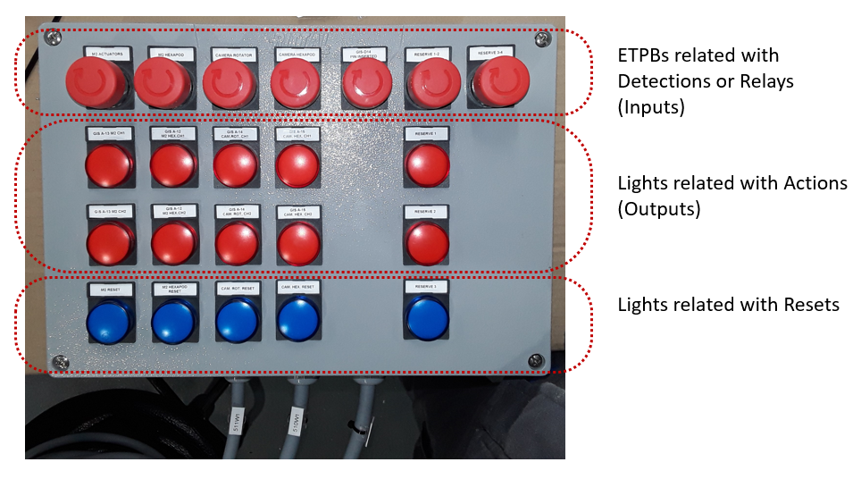

# Test Plan

|                             |                             |
|-----------------------------|-----------------------------|
| **Requested by:**           | **LSST**                    |
| **Doc. Code / Version nº:** | 7186_GIS_0007 / 2.0         |
| **Editor:**                 | A. Martin / F. Javier López |
| **Approved by:**            | F. Javier López             |
| **Date:**                   | 2022/08/30                  |

## Index

[1. Introduction [5](#introduction)](#introduction)

[2. Reference documents [5](#reference-documents)](#reference-documents)

[3. Technical description [5](#technical-description)](#technical-description)

[4. Testing procedure [7](#testing-procedure)](#testing-procedure)

[5. Detections testing [8](#detections-testing)](#detections-testing)

[5.1 D-1 GIS Fire Interlock [8](#d-1-gis-fire-interlock)](#d-1-gis-fire-interlock)

[5.2 D-2 Catastrophic Earthquake Interlock
[9](#d-2-catastrophic-earthquake-interlock)](#d-2-catastrophic-earthquake-interlock)

[5.3 D-3 GIS Internal Failure [11](#d-3-gis-internal-failure)](#d-3-gis-internal-failure)

[5.4 D-4 GIS ETPBs [12](#d-4-gis-etpbs)](#d-4-gis-etpbs)

[5.5 D-5 Unauthorized Pier access [13](#d-5-unauthorized-pier-access)](#d-5-unauthorized-pier-access)

[5.6 D-6 Unauthorized Dome access [14](#d-6-unauthorized-dome-access)](#d-6-unauthorized-dome-access)

[5.7 D-7 TMA Brakes NOT engaged [15](#d-7-tma-brakes-not-engaged)](#d-7-tma-brakes-not-engaged)

[5.8 D-8 Camera Cable Wrap Safety Device Actuated
[16](#d-8-camera-cable-wrap-safety-device-actuated)](#d-8-camera-cable-wrap-safety-device-actuated)

[5.9 D-9 TMA ETPBs [17](#d-9-tma-etpbs)](#d-9-tma-etpbs)

[5.10 D-10 Dome Locking pin retracted or Dome Rear Door Louvers NOT closed
[18](#d-10-dome-locking-pin-retracted-or-dome-rear-door-louvers-not-closed)](#d-10-dome-locking-pin-retracted-or-dome-rear-door-louvers-not-closed)

[5.11 D-11 Dome Rear doors are NOT closed
[19](#d-11-dome-rear-doors-are-not-closed)](#d-11-dome-rear-doors-are-not-closed)

[5.12 D-12 Dome ETPBs [20](#d-12-dome-etpbs)](#d-12-dome-etpbs)

[5.13 D-13 Dome Crane not parked [21](#d-13-dome-crane-not-parked)](#d-13-dome-crane-not-parked)

[5.14 D-14 Camera Rotator Pin Inserted [22](#d-14-camera-rotator-pin-inserted)](#d-14-camera-rotator-pin-inserted)

[5.15 D-15 Platform Lift above Enclosure Lower Level
[22](#d-15-platform-lift-above-enclosure-lower-level)](#d-15-platform-lift-above-enclosure-lower-level)

[5.16 D-16 Platform Lift NOT parked at the Telescope Level
[23](#d-16-platform-lift-not-parked-at-the-telescope-level)](#d-16-platform-lift-not-parked-at-the-telescope-level)

[5.17 D-17 Failed MCS Watchdog or MCS Loss of Communication
[24](#d-17-failed-mcs-watchdog-or-mcs-loss-of-communication)](#d-17-failed-mcs-watchdog-or-mcs-loss-of-communication)

[5.18 D-18 Man-Lift not parked [25](#d-18-man-lift-not-parked)](#d-18-man-lift-not-parked)

[5.19 D-19 Man-Lift not parked [26](#d-19-man-lift-not-parked)](#d-19-man-lift-not-parked)

[6. Relay interlocks testing [27](#relay-interlocks-testing)](#relay-interlocks-testing)

[6.1 GIS [27](#gis)](#gis)

[6.1.1 Wireless 1 [27](#wireless-1)](#wireless-1)

[6.1.2 Wireless 2 [27](#wireless-2)](#wireless-2)

[6.2 LASER [28](#laser)](#laser)

[6.2.1 Laser controller [28](#laser-controller)](#laser-controller)

[6.3 PFLOW [29](#pflow)](#pflow)

[6.3.1 PFlow [29](#pflow-1)](#pflow-1)

[6.4 M2 CAMERA [30](#m2-camera)](#m2-camera)

[6.4.1 M2 Actuator [30](#m2-actuator)](#m2-actuator)

[6.4.2 M2 Hexapod [30](#m2-hexapod)](#m2-hexapod)

[6.4.3 Camera Rotator [31](#camera-rotator)](#camera-rotator)

[6.4.4 Camera Hexapod [32](#camera-hexapod)](#camera-hexapod)

[6.5 ACCESS / FIRE / EARTHQUAKE [32](#access-fire-earthquake)](#access-fire-earthquake)

[6.5.1 Access [32](#access)](#access)

[6.5.2 Fire [33](#fire)](#fire)

[6.5.3 Earthquake [33](#earthquake)](#earthquake)

[7. Delays testing [34](#delays-testing)](#delays-testing)

[7.1 Earthquake delay [34](#earthquake-delay)](#earthquake-delay)

[8. User permissions check [36](#user-permissions-check)](#user-permissions-check)

[8.1 Level 3 permissions check [36](#level-3-permissions-check)](#level-3-permissions-check)

[8.2 Level 2 permissions check [36](#level-2-permissions-check)](#level-2-permissions-check)

### Document history

<table>
<colgroup>
<col style="width: 11%" />
<col style="width: 16%" />
<col style="width: 20%" />
<col style="width: 51%" />
</colgroup>
<tbody>
<tr class="odd">
<td><strong>Version</strong></td>
<td><strong>Date</strong></td>
<td><strong>Author</strong></td>
<td><strong>Comments</strong></td>
</tr>
<tr class="even">
<td><strong>1.0</strong></td>
<td>2019/05/16</td>
<td><blockquote>

A. Martín

</blockquote></td>
<td><blockquote>

<em>Initial release</em>

</blockquote></td>
</tr>
<tr class="odd">
<td><strong>2.0</strong></td>
<td>2019/06/03</td>
<td><blockquote>

A. Martín

</blockquote></td>
<td><blockquote>

<em>Actualization with the tests performed</em>

</blockquote></td>
</tr>
<tr class="even">
<td><strong>3.0</strong></td>
<td>2022/08/30</td>
<td><blockquote>

F. Javier López

</blockquote></td>
<td><blockquote>

<em>After review by Empresarios Agrupados</em>

</blockquote></td>
</tr>
<tr class="odd">
<td></td>
<td></td>
<td></td>
<td></td>
</tr>
<tr class="even">
<td></td>
<td></td>
<td></td>
<td></td>
</tr>
</tbody>
</table>

<table>
<colgroup>
<col style="width: 15%" />
<col style="width: 84%" />
</colgroup>
<thead>
<tr class="header">
<th><strong>Acronyms</strong></th>
<th><strong>Definition</strong></th>
</tr>
<tr class="odd">
<th>
AFE / AcFiEa

ETPB
</th>
<th>
Access Fire Earthquake

Emergency trip pushbutton
</th>
</tr>
<tr class="header">
<th>GIS</th>
<th>Global Interlock System</th>
</tr>
<tr class="odd">
<th>HMI</th>
<th>Human Machine Interface</th>
</tr>
<tr class="header">
<th>
IS

LAS
</th>
<th>
Interlock System

LASER
</th>
</tr>
<tr class="odd">
<th>
LSST

UI
</th>
<th>
Large Synoptic Survey Telescope

User Interface
</th>
</tr>
</thead>
<tbody>
</tbody>
</table>

## Introduction

This document collects the procedures performed to verify the correct function of the Global Interlock System (GIS),
which ensures the protection of the different systems of the telescope.

It includes the steps followed to complete GIS tests. Passing the tests confirms the correct communication, reception
and emission of signals, between the different safety systems and, summarizing, the correct actuation of the system.

## Reference documents

|        |                                                                    |                      |             |
|--------|--------------------------------------------------------------------|----------------------|-------------|
| **Nº** | **Document**                                                       | **Code**             | **Version** |
| **1**  | GLOBAL INTERLOCK SYSTEM (GIS) ANALYSIS                             | 092-308-E-Z-00004    | 04          |
| **2**  | Updated LTS-99                                                     | 092-308-F-I-00003_01 | 01          |
| **3**  | Electric schemes -- 7186 Test System for GISS_LSST Cabinets        | *7186_GIS_0003*      | 1.0         |
| **4**  | Electric schemes - 7186 LSST Global Safety Interlock System Design | *7186_GIS_0001*      | 1.0         |
| **5**  | GIS User Interface Manual                                          | *7186_GIS_0005*      | 1.0         |

## Technical description

**Architecture:**

The safety interlock system of the telescope, named Global Interlock System (GIS) hereafter, is a distributed
arrangement where a central safety controller is connected to all subsystem controllers (M2, TMA, Dome, etc.), by means
of safety networks.

LASER, M2, PFLOW and AcFiEa subsystem controllers are directly connected to the central safety controller. Those
subsystems compose the central controller's periphery.

**Testing architecture:**

The architecture described below is the structure where the actuation of the Global Interlock System (GIS) is tested.

LASER, M2, PFLOW and AcFiEa subsystem controllers are hardwired to distributed I/O modules. Those modules are connected
to the central controller by means of safety networks.

Hence, GIS and GIS's periphery are tested in a real architecture situation.

M1M3, TMA, AUX and DOME are systems with a dedicated safety controller. Those systems are connected to the central
controller by means of safety networks. However, for testing architecture there is only one controller (apart from the
central controller), hence, the connection of M1M3, TMA, AUX AND DOME systems with central controller will be tested one
by one.

{width="6.298611111111111in" height="3.71875in"}

Fig. 1 Testing architecture overview.

Testing architecture sends the input signals to the Central Controller and receives the output signals from the Central
Controller. This communication is programmed with PASconnect, in PAS4000.

Detections, relays and signals related with LASER, M2, PFLOW and AcFiEa systems are reproduced physically with ETPBs and
LEDs, as it is shown in Fig. 2.

{width="6.298611111111111in" height="3.502083333333333in"}

Fig. 2 Testing architecture.

## Testing procedure

Tests are performed in the installations of IK4-TEKNIKER, with the architecture described in the document
7186-GIS_TestSystem.pdf (referenced in section [2 Reference documents]{.underline}).

Detections and relays will be checked individually, one by one. Also, the Detection that can be delayed will be check
independently.

First, detections will be tested one by one, afterwards, relays and, finally, the delays. Detailed procedure with every
step is presented in the following sections.

Detections and relay forcing method depends on the system to which belong:

-   Signals from the external controller, "testing controller", are forced via software.

-   The rest of the signals, from M1M3, TMA, AUX and DOME systems, are forced by pressing the corresponding ETPB.

Detection' signals are check in UI and via software.

Relay signals are check in the UI. Relay signals can activate Detections, hence, the corresponding Actions are
activated.

The Actions associated with those inputs will be checked observing signals (in HMI or in the software) and, in case
there is a LED associated with the signal involved, observing the state of that LED.

-   Action signals to the external controller, "testing controller", are checked in HMI and via software.

-   Action signals to the Central Controller are checked in HMI and in the corresponding LEDs.

<table>
<colgroup>
<col style="width: 14%" />
<col style="width: 40%" />
<col style="width: 45%" />
</colgroup>
<thead>
<tr class="header">
<th>ITEM</th>
<th>FORCING METHOD</th>
<th>CHECKING METHOD</th>
</tr>
</thead>
<tbody>
<tr class="odd">
<td>Detection</td>
<td>
-M1M3, TMA, AUX and DOME systems: Pressing ETPB.

-Other systems: software.
</td>
<td>UI and software.</td>
</tr>
<tr class="even">
<td>Relay</td>
<td>-M1M3, TMA, AUX and DOME systems: Pressing ETPB.</td>
<td>
Relay state in UI.

Detection (and corresponding Actions) originated by the relay in UI and software.
</td>
</tr>
<tr class="odd">
<td>Action</td>
<td>
Cannot be forced by itself.

When a detection that originates the release of the action is active, the action signal is activated.
</td>
<td>
-M1M3, TMA, AUX and DOME systems: LED, UI and software.

-Other systems: UI and software.
</td>
</tr>
<tr class="even">
<td>Reset</td>
<td>By pressing RESET button in the UI.</td>
<td>
-M1M3, TMA, AUX and DOME systems: LED, UI and software.

-Other systems: UI and software.
</td>
</tr>
</tbody>
</table>

Table 1 Signals forcing and checking method.

### Detections testing

This part will be performed with a user logged in with administrator permissions, Level 4 of user management, because it
is necessary to bypass the signals, only allowed at this level. User levels is described in the document GIS User
Interface Manual, (Ref: 5).

#### D-1 GIS Fire Interlock

The aim of this test is to verify the right actuation of Global Interlock System (GIS) when the event GIS Fire Interlock
(D-1) is detected.

This test is performed by activating the corresponding interlock (in testing architecture is reproduced by a emergency
trip pushbutton (ETPB) ).

<table>
<colgroup>
<col style="width: 70%" />
<col style="width: 14%" />
<col style="width: 15%" />
</colgroup>
<thead>
<tr class="header">
<th><strong>Identification to be tested:</strong></th>
<th><strong>Checked</strong></th>
<th><strong>Responsible</strong></th>
</tr>
</thead>
<tbody>
<tr class="odd">
<td>None signal is activated.</td>
<td><ul>
<li></li>
</ul></td>
<td>F.J.Lopez</td>
</tr>
<tr class="even">
<td>Press the interlock related with D-1.</td>
<td><ul>
<li></li>
</ul></td>
<td>F.J.Lopez</td>
</tr>
<tr class="odd">
<td>Check that GIS activates D-1 signal.</td>
<td><ul>
<li></li>
</ul></td>
<td>F.J.Lopez</td>
</tr>
<tr class="even">
<td>Check Detection alarm is actived.</td>
<td><ul>
<li></li>
</ul></td>
<td>F.J.Lopez</td>
</tr>
<tr class="odd">
<td>Check GIS activates A-1 indication and sends actuation signals.</td>
<td><ul>
<li></li>
</ul></td>
<td>F.J.Lopez</td>
</tr>
<tr class="even">
<td>Bypass the interlock.</td>
<td><ul>
<li></li>
</ul></td>
<td>F.J.Lopez</td>
</tr>
<tr class="odd">
<td>Check bypass warning message is actived. Detection alarm is cleared.</td>
<td><ul>
<li></li>
</ul></td>
<td>F.J.Lopez</td>
</tr>
<tr class="even">
<td>Check all signals are cleared.</td>
<td><ul>
<li></li>
</ul></td>
<td>F.J.Lopez</td>
</tr>
<tr class="odd">
<td>Relese bypassed interlock.</td>
<td><ul>
<li></li>
</ul></td>
<td>F.J.Lopez</td>
</tr>
<tr class="even">
<td>Check all the above signals remain active.</td>
<td><ul>
<li></li>
</ul></td>
<td>F.J.Lopez</td>
</tr>
<tr class="odd">
<td>Bypass warning message is cleared. Detection error message is actived.</td>
<td><ul>
<li></li>
</ul></td>
<td>F.J.Lopez</td>
</tr>
<tr class="even">
<td>Check interlocks cannot be reset. Check all the signals remain active.</td>
<td><ul>
<li></li>
</ul></td>
<td>F.J.Lopez</td>
</tr>
<tr class="odd">
<td>Release by turning the interlock that was actuated.</td>
<td><ul>
<li></li>
</ul></td>
<td>F.J.Lopez</td>
</tr>
<tr class="even">
<td>Check all interlocks are cleared.</td>
<td><ul>
<li></li>
</ul></td>
<td>F.J.Lopez</td>
</tr>
<tr class="odd">
<td>Check Detection alarm is cleared.</td>
<td><ul>
<li></li>
</ul></td>
<td>F.J.Lopez</td>
</tr>
<tr class="even">
<td>Write down the date of the test: 2019/05/27</td>
<td><ul>
<li></li>
</ul></td>
<td>F.J.Lopez</td>
</tr>
</tbody>
</table>

#### D-2 Catastrophic Earthquake Interlock

The aim of this test is to verify the right actuation of Global Interlock System (GIS) when the event Catastrophic
Earthquake Interlock (D-2) is detected.

This test is performed by activating the corresponding interlock (in testing architecture is reproduced by a emergency
trip pushbutton (ETPB).

<table>
<colgroup>
<col style="width: 70%" />
<col style="width: 14%" />
<col style="width: 15%" />
</colgroup>
<thead>
<tr class="header">
<th><strong>Identification to be tested:</strong></th>
<th><strong>Checked</strong></th>
<th><strong>Responsible</strong></th>
</tr>
</thead>
<tbody>
<tr class="odd">
<td>None signal is activated.</td>
<td><ul>
<li></li>
</ul></td>
<td>F.J.Lopez</td>
</tr>
<tr class="even">
<td>Press the interlock related with D-2.</td>
<td><ul>
<li></li>
</ul></td>
<td>F.J.Lopez</td>
</tr>
<tr class="odd">
<td>Check GIS activates D-2 indication.</td>
<td><ul>
<li></li>
</ul></td>
<td>F.J.Lopez</td>
</tr>
<tr class="even">
<td>Check Detection alarm is actived.</td>
<td><ul>
<li></li>
</ul></td>
<td>F.J.Lopez</td>
</tr>
<tr class="odd">
<td>Check GIS activates A-3 indication and sends actuation signal.</td>
<td><ul>
<li></li>
</ul></td>
<td>F.J.Lopez</td>
</tr>
<tr class="even">
<td>Check GIS activates A-4 indication and sends actuation signal.</td>
<td><ul>
<li></li>
</ul></td>
<td>F.J.Lopez</td>
</tr>
<tr class="odd">
<td>Check GIS activates A-5 indication and sends actuation signal.</td>
<td><ul>
<li></li>
</ul></td>
<td>F.J.Lopez</td>
</tr>
<tr class="even">
<td>Check GIS activates A-6 indication and sends actuation signal.</td>
<td><ul>
<li></li>
</ul></td>
<td>F.J.Lopez</td>
</tr>
<tr class="odd">
<td>Check GIS activates A-7 indication and sends actuation signal.</td>
<td><ul>
<li></li>
</ul></td>
<td>F.J.Lopez</td>
</tr>
<tr class="even">
<td>Check GIS activates A-9 indication and sends actuation signal.</td>
<td><ul>
<li></li>
</ul></td>
<td>F.J.Lopez</td>
</tr>
<tr class="odd">
<td>Check GIS activates A-10 indication and sends actuation signal.</td>
<td><ul>
<li></li>
</ul></td>
<td>F.J.Lopez</td>
</tr>
<tr class="even">
<td>Check GIS activates A-11 indication and sends actuation signal.</td>
<td><ul>
<li></li>
</ul></td>
<td>F.J.Lopez</td>
</tr>
<tr class="odd">
<td>Check GIS activates A-12 indication and sends actuation signal.</td>
<td><ul>
<li></li>
</ul></td>
<td>F.J.Lopez</td>
</tr>
<tr class="even">
<td>Check GIS activates A-13 indication and sends actuation signal.</td>
<td><ul>
<li></li>
</ul></td>
<td>F.J.Lopez</td>
</tr>
<tr class="odd">
<td>Check GIS activates A-14 indication and sends actuation signal.</td>
<td><ul>
<li></li>
</ul></td>
<td>F.J.Lopez</td>
</tr>
<tr class="even">
<td>Check GIS activates A-15 indication and sends actuation signal.</td>
<td><ul>
<li></li>
</ul></td>
<td>F.J.Lopez</td>
</tr>
<tr class="odd">
<td>Check GIS activates A-16 indication and sends actuation signal.</td>
<td><ul>
<li></li>
</ul></td>
<td>F.J.Lopez</td>
</tr>
<tr class="even">
<td>Check GIS activates A-18 indication and sends actuation signal.</td>
<td><ul>
<li></li>
</ul></td>
<td>F.J.Lopez</td>
</tr>
<tr class="odd">
<td>Check GIS activates A-20 indication and sends actuation signal.</td>
<td><ul>
<li></li>
</ul></td>
<td>F.J.Lopez</td>
</tr>
<tr class="even">
<td>Bypass the interlock.</td>
<td><ul>
<li></li>
</ul></td>
<td>F.J.Lopez</td>
</tr>
<tr class="odd">
<td>Check bypass warning message is actived. Detection alarm is cleared.</td>
<td><ul>
<li></li>
</ul></td>
<td>F.J.Lopez</td>
</tr>
<tr class="even">
<td>Check all signals are cleared.</td>
<td><ul>
<li></li>
</ul></td>
<td>F.J.Lopez</td>
</tr>
<tr class="odd">
<td>Relese bypassed interlock.</td>
<td><ul>
<li></li>
</ul></td>
<td>F.J.Lopez</td>
</tr>
<tr class="even">
<td>Check all the above signals remain active.</td>
<td><ul>
<li></li>
</ul></td>
<td>F.J.Lopez</td>
</tr>
<tr class="odd">
<td>Bypass warning message is cleared. Detection error message is actived.</td>
<td><ul>
<li></li>
</ul></td>
<td>F.J.Lopez</td>
</tr>
<tr class="even">
<td>Check interlocks cannot be reset. Check all the signals remain active.</td>
<td><ul>
<li></li>
</ul></td>
<td>F.J.Lopez</td>
</tr>
<tr class="odd">
<td>Release by turning the interlock that was actuated.</td>
<td><ul>
<li></li>
</ul></td>
<td>F.J.Lopez</td>
</tr>
<tr class="even">
<td>Check all interlocks are cleared.</td>
<td><ul>
<li></li>
</ul></td>
<td>F.J.Lopez</td>
</tr>
<tr class="odd">
<td>Check Detection alarm is cleared.</td>
<td><ul>
<li></li>
</ul></td>
<td>F.J.Lopez</td>
</tr>
<tr class="even">
<td>Write down the date of the test: 2019/05/27</td>
<td><ul>
<li></li>
</ul></td>
<td>F.J.Lopez</td>
</tr>
</tbody>
</table>

#### D-3 GIS Internal Failure

The aim of this test is to verify the right actuation of Global Interlock System (GIS) when the event GIS Internal
Failure (D-3) is detected.

This test is performed by activating the corresponding interlock (in testing architecture is reproduced by a signal from
Testing Controller).

<table>
<colgroup>
<col style="width: 70%" />
<col style="width: 14%" />
<col style="width: 15%" />
</colgroup>
<thead>
<tr class="header">
<th><strong>Identification to be tested:</strong></th>
<th><strong>Checked</strong></th>
<th><strong>Responsible</strong></th>
</tr>
</thead>
<tbody>
<tr class="odd">
<td>None signal is activated.</td>
<td><ul>
<li></li>
</ul></td>
<td>F.J.Lopez</td>
</tr>
<tr class="even">
<td>Press the interlock related with D-3.</td>
<td><ul>
<li></li>
</ul></td>
<td>F.J.Lopez</td>
</tr>
<tr class="odd">
<td>Check that GIS activates D-3 indication.</td>
<td><ul>
<li></li>
</ul></td>
<td>F.J.Lopez</td>
</tr>
<tr class="even">
<td>Check Detection alarm is actived.</td>
<td><ul>
<li></li>
</ul></td>
<td>F.J.Lopez</td>
</tr>
<tr class="odd">
<td>Check GIS activates A-4 indication and sends actuation signal.</td>
<td><ul>
<li></li>
</ul></td>
<td>F.J.Lopez</td>
</tr>
<tr class="even">
<td>Check GIS activates A-5 indication and sends actuation signal.</td>
<td><ul>
<li></li>
</ul></td>
<td>F.J.Lopez</td>
</tr>
<tr class="odd">
<td>Check GIS activates A-6 indication and sends actuation signal.</td>
<td><ul>
<li></li>
</ul></td>
<td>F.J.Lopez</td>
</tr>
<tr class="even">
<td>Check GIS activates A-7 indication and sends actuation signal.</td>
<td><ul>
<li></li>
</ul></td>
<td>F.J.Lopez</td>
</tr>
<tr class="odd">
<td>Check GIS activates A-9 indication and sends actuation signal.</td>
<td><ul>
<li></li>
</ul></td>
<td>F.J.Lopez</td>
</tr>
<tr class="even">
<td>Check GIS activates A-10 indication and sends actuation signal.</td>
<td><ul>
<li></li>
</ul></td>
<td>F.J.Lopez</td>
</tr>
<tr class="odd">
<td>Check GIS activates A-11 indication and sends actuation signal.</td>
<td><ul>
<li></li>
</ul></td>
<td>F.J.Lopez</td>
</tr>
<tr class="even">
<td>Check GIS activates A-12 indication and sends actuation signal.</td>
<td><ul>
<li></li>
</ul></td>
<td>F.J.Lopez</td>
</tr>
<tr class="odd">
<td>Check GIS activates A-13 indication and sends actuation signal.</td>
<td><ul>
<li></li>
</ul></td>
<td>F.J.Lopez</td>
</tr>
<tr class="even">
<td>Check GIS activates A-14 indication and sends actuation signal.</td>
<td><ul>
<li></li>
</ul></td>
<td>F.J.Lopez</td>
</tr>
<tr class="odd">
<td>Check GIS activates A-15 indication and sends actuation signal.</td>
<td><ul>
<li></li>
</ul></td>
<td>F.J.Lopez</td>
</tr>
<tr class="even">
<td>Check GIS activates A-17 indication and sends actuation signal.</td>
<td><ul>
<li></li>
</ul></td>
<td>F.J.Lopez</td>
</tr>
<tr class="odd">
<td>Check GIS activates A-19 indication and sends actuation signal.</td>
<td><ul>
<li></li>
</ul></td>
<td>F.J.Lopez</td>
</tr>
<tr class="even">
<td>Check GIS activates A-20 indication and sends actuation signal.</td>
<td><ul>
<li></li>
</ul></td>
<td>F.J.Lopez</td>
</tr>
<tr class="odd">
<td>Bypass the interlock.</td>
<td><ul>
<li></li>
</ul></td>
<td>F.J.Lopez</td>
</tr>
<tr class="even">
<td>Check bypass warning message is actived. Detection alarm is cleared.</td>
<td><ul>
<li></li>
</ul></td>
<td>F.J.Lopez</td>
</tr>
<tr class="odd">
<td>Check all signals are cleared.</td>
<td><ul>
<li></li>
</ul></td>
<td>F.J.Lopez</td>
</tr>
<tr class="even">
<td>Relese bypassed interlock.</td>
<td><ul>
<li></li>
</ul></td>
<td>F.J.Lopez</td>
</tr>
<tr class="odd">
<td>Check all the above signals remain active.</td>
<td><ul>
<li></li>
</ul></td>
<td>F.J.Lopez</td>
</tr>
<tr class="even">
<td>Bypass warning message is cleared. Detection error message is actived.</td>
<td><ul>
<li></li>
</ul></td>
<td>F.J.Lopez</td>
</tr>
<tr class="odd">
<td>Check interlocks cannot be reset. Check all the signals remain active.</td>
<td><ul>
<li></li>
</ul></td>
<td>F.J.Lopez</td>
</tr>
<tr class="even">
<td>Release by turning the interlock that was actuated.</td>
<td><ul>
<li></li>
</ul></td>
<td>F.J.Lopez</td>
</tr>
<tr class="odd">
<td>Check all interlocks are cleared.</td>
<td><ul>
<li></li>
</ul></td>
<td>F.J.Lopez</td>
</tr>
<tr class="even">
<td>Check Detection alarm is cleared.</td>
<td><ul>
<li></li>
</ul></td>
<td>F.J.Lopez</td>
</tr>
<tr class="odd">
<td>Write down the date of the test: 2019/06/03</td>
<td><ul>
<li></li>
</ul></td>
<td>F.J.Lopez</td>
</tr>
</tbody>
</table>

#### D-4 GIS ETPBs

The aim of this test is to verify the right actuation of Global Interlock System (GIS) when the event GIS ETPBs (D-4) is
detected.

This test is performed by activating the corresponding interlock (in testing architecture is reproduced by a emergency
trip pushbutton (ETPB)).

Detection D-4 is activated when a ETPB of its system is activated. In the test, the ETPB pressed to actívate D-4 is:
Wireless1. This event, Wireless1, must be reset.

<table>
<colgroup>
<col style="width: 70%" />
<col style="width: 14%" />
<col style="width: 15%" />
</colgroup>
<thead>
<tr class="header">
<th><strong>Identification to be tested:</strong></th>
<th><strong>Checked</strong></th>
<th><strong>Responsible</strong></th>
</tr>
</thead>
<tbody>
<tr class="odd">
<td>None signal is activated.</td>
<td><ul>
<li></li>
</ul></td>
<td>F.J.Lopez</td>
</tr>
<tr class="even">
<td>Press the interlock related with D-4.</td>
<td><ul>
<li></li>
</ul></td>
<td>F.J.Lopez</td>
</tr>
<tr class="odd">
<td>Check Detection alarm is actived.</td>
<td><ul>
<li></li>
</ul></td>
<td>F.J.Lopez</td>
</tr>
<tr class="even">
<td>Check that GIS activates D-4 indication.</td>
<td><ul>
<li></li>
</ul></td>
<td>F.J.Lopez</td>
</tr>
<tr class="odd">
<td>Check GIS activates A-4 indication and sends actuation signal.</td>
<td><ul>
<li></li>
</ul></td>
<td>F.J.Lopez</td>
</tr>
<tr class="even">
<td>Check GIS activates A-5 indication and sends actuation signal.</td>
<td><ul>
<li></li>
</ul></td>
<td>F.J.Lopez</td>
</tr>
<tr class="odd">
<td>Check GIS activates A-6 indication and sends actuation signal.</td>
<td><ul>
<li></li>
</ul></td>
<td>F.J.Lopez</td>
</tr>
<tr class="even">
<td>Check GIS activates A-7 indication and sends actuation signal.</td>
<td><ul>
<li></li>
</ul></td>
<td>F.J.Lopez</td>
</tr>
<tr class="odd">
<td>Check GIS activates A-8 indication and sends actuation signal.</td>
<td><ul>
<li></li>
</ul></td>
<td>F.J.Lopez</td>
</tr>
<tr class="even">
<td>Check GIS activates A-9 indication and sends actuation signal.</td>
<td><ul>
<li></li>
</ul></td>
<td>F.J.Lopez</td>
</tr>
<tr class="odd">
<td>Check GIS activates A-10 indication and sends actuation signal.</td>
<td><ul>
<li></li>
</ul></td>
<td>F.J.Lopez</td>
</tr>
<tr class="even">
<td>Check GIS activates A-11 indication and sends actuation signal.</td>
<td><ul>
<li></li>
</ul></td>
<td>F.J.Lopez</td>
</tr>
<tr class="odd">
<td>Check GIS activates A-12 indication and sends actuation signal.</td>
<td><ul>
<li></li>
</ul></td>
<td>F.J.Lopez</td>
</tr>
<tr class="even">
<td>Check GIS activates A-13 indication and sends actuation signal.</td>
<td><ul>
<li></li>
</ul></td>
<td>F.J.Lopez</td>
</tr>
<tr class="odd">
<td>Check GIS activates A-14 indication and sends actuation signal.</td>
<td><ul>
<li></li>
</ul></td>
<td>F.J.Lopez</td>
</tr>
<tr class="even">
<td>Check GIS activates A-15 indication and sends actuation signal.</td>
<td><ul>
<li></li>
</ul></td>
<td>F.J.Lopez</td>
</tr>
<tr class="odd">
<td>Check GIS activates A-17 indication and sends actuation signal.</td>
<td><ul>
<li></li>
</ul></td>
<td>F.J.Lopez</td>
</tr>
<tr class="even">
<td>Check GIS activates A-19 indication and sends actuation signal.</td>
<td><ul>
<li></li>
</ul></td>
<td>F.J.Lopez</td>
</tr>
<tr class="odd">
<td>Check GIS activates A-20 indication and sends actuation signal.</td>
<td><ul>
<li></li>
</ul></td>
<td>F.J.Lopez</td>
</tr>
<tr class="even">
<td>Check GIS activates A-21 indication and sends actuation signal.</td>
<td><ul>
<li></li>
</ul></td>
<td>F.J.Lopez</td>
</tr>
<tr class="odd">
<td>Bypass the interlock.</td>
<td><ul>
<li></li>
</ul></td>
<td>F.J.Lopez</td>
</tr>
<tr class="even">
<td>Check bypass warning message is activated. Detection alarm is cleared.</td>
<td><ul>
<li></li>
</ul></td>
<td>F.J.Lopez</td>
</tr>
<tr class="odd">
<td>Check all signals are cleared.</td>
<td><ul>
<li></li>
</ul></td>
<td>F.J.Lopez</td>
</tr>
<tr class="even">
<td>Relese bypassed interlock.</td>
<td><ul>
<li></li>
</ul></td>
<td>F.J.Lopez</td>
</tr>
<tr class="odd">
<td>Check all the above signals remain active.</td>
<td><ul>
<li></li>
</ul></td>
<td>F.J.Lopez</td>
</tr>
<tr class="even">
<td>Bypass warning message is cleared. Detection error message is activated.</td>
<td><ul>
<li></li>
</ul></td>
<td>F.J.Lopez</td>
</tr>
<tr class="odd">
<td>Reset interlock by pressing RESET button.</td>
<td><ul>
<li></li>
</ul></td>
<td>F.J.Lopez</td>
</tr>
<tr class="even">
<td>Check all the signals remain active.</td>
<td><ul>
<li></li>
</ul></td>
<td>F.J.Lopez</td>
</tr>
<tr class="odd">
<td>Release by turning the interlock that was actuated.</td>
<td><ul>
<li></li>
</ul></td>
<td>F.J.Lopez</td>
</tr>
<tr class="even">
<td>Reset interlock by pressing RESET button.</td>
<td><ul>
<li></li>
</ul></td>
<td>F.J.Lopez</td>
</tr>
<tr class="odd">
<td>Check all interlocks are cleared.</td>
<td><ul>
<li></li>
</ul></td>
<td>F.J.Lopez</td>
</tr>
<tr class="even">
<td>Check Detection alarm is cleared.</td>
<td><ul>
<li></li>
</ul></td>
<td>F.J.Lopez</td>
</tr>
<tr class="odd">
<td>Write down the date of the test: 2019/05/27</td>
<td><ul>
<li></li>
</ul></td>
<td>F.J.Lopez</td>
</tr>
</tbody>
</table>

#### D-5 Unauthorized Pier access

The aim of this test is to verify the right actuation of Global Interlock System (GIS) when the event Unathorized Pier
Access (D-5) is detected.

This test is performed by activating the corresponding interlock (in testing architecture is reproduced by a emergency
trip pushbutton (ETPB).

<table>
<colgroup>
<col style="width: 70%" />
<col style="width: 14%" />
<col style="width: 15%" />
</colgroup>
<thead>
<tr class="header">
<th><strong>Identification to be tested:</strong></th>
<th><strong>Checked</strong></th>
<th><strong>Responsible</strong></th>
</tr>
</thead>
<tbody>
<tr class="odd">
<td>None signal is activated.</td>
<td><ul>
<li></li>
</ul></td>
<td>F.J.Lopez</td>
</tr>
<tr class="even">
<td>Press the interlock related with D-5.</td>
<td><ul>
<li></li>
</ul></td>
<td>F.J.Lopez</td>
</tr>
<tr class="odd">
<td>Check Detection alarm is actived.</td>
<td><ul>
<li></li>
</ul></td>
<td>F.J.Lopez</td>
</tr>
<tr class="even">
<td>Check that GIS activates D-5 signal.</td>
<td><ul>
<li></li>
</ul></td>
<td>F.J.Lopez</td>
</tr>
<tr class="odd">
<td>Check Detection alarm is active.</td>
<td><ul>
<li></li>
</ul></td>
<td>F.J.Lopez</td>
</tr>
<tr class="even">
<td>Check GIS activates A-5 indication and sends actuation signal.</td>
<td><ul>
<li></li>
</ul></td>
<td>F.J.Lopez</td>
</tr>
<tr class="odd">
<td>Bypass the interlock.</td>
<td><ul>
<li></li>
</ul></td>
<td>F.J.Lopez</td>
</tr>
<tr class="even">
<td>Check bypass warning message is actived. Detection alarm is cleared.</td>
<td><ul>
<li></li>
</ul></td>
<td>F.J.Lopez</td>
</tr>
<tr class="odd">
<td>Check all signals are cleared.</td>
<td><ul>
<li></li>
</ul></td>
<td>F.J.Lopez</td>
</tr>
<tr class="even">
<td>Relese bypassed interlock.</td>
<td><ul>
<li></li>
</ul></td>
<td>F.J.Lopez</td>
</tr>
<tr class="odd">
<td>Check all the above signals remain active.</td>
<td><ul>
<li></li>
</ul></td>
<td>F.J.Lopez</td>
</tr>
<tr class="even">
<td>Bypass warning message is cleared. Detection error message is actived.</td>
<td><ul>
<li></li>
</ul></td>
<td>F.J.Lopez</td>
</tr>
<tr class="odd">
<td>Check interlocks cannot be reset. Check all the signals remain active.</td>
<td><ul>
<li></li>
</ul></td>
<td>F.J.Lopez</td>
</tr>
<tr class="even">
<td>Release by turning the interlock that was actuated.</td>
<td><ul>
<li></li>
</ul></td>
<td>F.J.Lopez</td>
</tr>
<tr class="odd">
<td>Check all interlocks are cleared.</td>
<td><ul>
<li></li>
</ul></td>
<td>F.J.Lopez</td>
</tr>
<tr class="even">
<td>Check Detection alarm is cleared.</td>
<td><ul>
<li></li>
</ul></td>
<td>F.J.Lopez</td>
</tr>
<tr class="odd">
<td>Write down the date of the test: 2019/05/27</td>
<td><ul>
<li></li>
</ul></td>
<td>F.J.Lopez</td>
</tr>
</tbody>
</table>

#### D-6 Unauthorized Dome access

The aim of this test is to verify the right actuation of Global Interlock System (GIS) when the event Unathorized Dome
access (D-6) is detected.

This test is performed by activating the corresponding interlock (in testing architecture is reproduced by a emergency
trip pushbutton (ETPB).

<table>
<colgroup>
<col style="width: 70%" />
<col style="width: 14%" />
<col style="width: 15%" />
</colgroup>
<thead>
<tr class="header">
<th><strong>Identification to be tested:</strong></th>
<th><strong>Checked</strong></th>
<th><strong>Responsible</strong></th>
</tr>
</thead>
<tbody>
<tr class="odd">
<td>None signal is activated.</td>
<td><ul>
<li></li>
</ul></td>
<td>F.J.Lopez</td>
</tr>
<tr class="even">
<td>Press the interlock related with D-6.</td>
<td><ul>
<li></li>
</ul></td>
<td>F.J.Lopez</td>
</tr>
<tr class="odd">
<td>Check Detection alarm is actived.</td>
<td><ul>
<li></li>
</ul></td>
<td>F.J.Lopez</td>
</tr>
<tr class="even">
<td>Check that GIS activates D-6 indication.</td>
<td><ul>
<li></li>
</ul></td>
<td>F.J.Lopez</td>
</tr>
<tr class="odd">
<td>Check GIS activates A-5 indication and sends actuation signal.</td>
<td><ul>
<li></li>
</ul></td>
<td>F.J.Lopez</td>
</tr>
<tr class="even">
<td>Check GIS activates A-11 indication and sends actuation signal.</td>
<td><ul>
<li></li>
</ul></td>
<td>F.J.Lopez</td>
</tr>
<tr class="odd">
<td>Check GIS activates A-20 indication and sends actuation signal.</td>
<td><ul>
<li></li>
</ul></td>
<td>F.J.Lopez</td>
</tr>
<tr class="even">
<td>Bypass the interlock.</td>
<td><ul>
<li></li>
</ul></td>
<td>F.J.Lopez</td>
</tr>
<tr class="odd">
<td>Check bypass warning message is actived. Detection alarm is cleared.</td>
<td><ul>
<li></li>
</ul></td>
<td>F.J.Lopez</td>
</tr>
<tr class="even">
<td>Check all signals are cleared.</td>
<td><ul>
<li></li>
</ul></td>
<td>F.J.Lopez</td>
</tr>
<tr class="odd">
<td>Relese bypassed interlock.</td>
<td><ul>
<li></li>
</ul></td>
<td>F.J.Lopez</td>
</tr>
<tr class="even">
<td>Check all the above signals remain active.</td>
<td><ul>
<li></li>
</ul></td>
<td>F.J.Lopez</td>
</tr>
<tr class="odd">
<td>Bypass warning message is cleared. Detection error message is actived.</td>
<td><ul>
<li></li>
</ul></td>
<td>F.J.Lopez</td>
</tr>
<tr class="even">
<td>Check interlocks cannot be reset. Check all the signals remain active.</td>
<td><ul>
<li></li>
</ul></td>
<td>F.J.Lopez</td>
</tr>
<tr class="odd">
<td>Release by turning the interlock that was actuated.</td>
<td><ul>
<li></li>
</ul></td>
<td>F.J.Lopez</td>
</tr>
<tr class="even">
<td>Check all interlocks are cleared.</td>
<td><ul>
<li></li>
</ul></td>
<td>F.J.Lopez</td>
</tr>
<tr class="odd">
<td>Check Detection alarm is cleared.</td>
<td><ul>
<li></li>
</ul></td>
<td>F.J.Lopez</td>
</tr>
<tr class="even">
<td>Write down the date of the test: 2019/05/27</td>
<td><ul>
<li></li>
</ul></td>
<td>F.J.Lopez</td>
</tr>
</tbody>
</table>

#### D-7 TMA Brakes NOT engaged

The aim of this test is to verify the right actuation of Global Interlock System (GIS) when the event TMA Brakes NOT
engaged (D-7) is detected.

This test is performed by activating the corresponding interlock (in testing architecture is reproduced by a signal from
Testing Controller).

<table>
<colgroup>
<col style="width: 70%" />
<col style="width: 14%" />
<col style="width: 15%" />
</colgroup>
<thead>
<tr class="header">
<th><strong>Identification to be tested:</strong></th>
<th><strong>Checked</strong></th>
<th><strong>Responsible</strong></th>
</tr>
</thead>
<tbody>
<tr class="odd">
<td>None signal is activated.</td>
<td><ul>
<li></li>
</ul></td>
<td>F.J.Lopez</td>
</tr>
<tr class="even">
<td>Press the interlock related with D-7.</td>
<td><ul>
<li></li>
</ul></td>
<td>F.J.Lopez</td>
</tr>
<tr class="odd">
<td>Check Detection alarm is actived.</td>
<td><ul>
<li></li>
</ul></td>
<td>F.J.Lopez</td>
</tr>
<tr class="even">
<td>Check that GIS activates D-7 indication.</td>
<td><ul>
<li></li>
</ul></td>
<td>F.J.Lopez</td>
</tr>
<tr class="odd">
<td>Check GIS activates A-8 indication and sends actuation signal.</td>
<td><ul>
<li></li>
</ul></td>
<td>F.J.Lopez</td>
</tr>
<tr class="even">
<td>Check GIS activates A-21 indication and sends actuation signal.</td>
<td><ul>
<li></li>
</ul></td>
<td>F.J.Lopez</td>
</tr>
<tr class="odd">
<td>Bypass the interlock.</td>
<td><ul>
<li></li>
</ul></td>
<td>F.J.Lopez</td>
</tr>
<tr class="even">
<td>Check bypass warning message is actived. Detection alarm is cleared.</td>
<td><ul>
<li></li>
</ul></td>
<td>F.J.Lopez</td>
</tr>
<tr class="odd">
<td>Check all signals are cleared.</td>
<td><ul>
<li></li>
</ul></td>
<td>F.J.Lopez</td>
</tr>
<tr class="even">
<td>Relese bypassed interlock.</td>
<td><ul>
<li></li>
</ul></td>
<td>F.J.Lopez</td>
</tr>
<tr class="odd">
<td>Check all the above signals remain active.</td>
<td><ul>
<li></li>
</ul></td>
<td>F.J.Lopez</td>
</tr>
<tr class="even">
<td>Bypass warning message is cleared. Detection error message is actived.</td>
<td><ul>
<li></li>
</ul></td>
<td>F.J.Lopez</td>
</tr>
<tr class="odd">
<td>Check interlocks cannot be reset. Check all the signals remain active.</td>
<td><ul>
<li></li>
</ul></td>
<td>F.J.Lopez</td>
</tr>
<tr class="even">
<td>Release by turning the interlock that was actuated.</td>
<td><ul>
<li></li>
</ul></td>
<td>F.J.Lopez</td>
</tr>
<tr class="odd">
<td>Check all interlocks are cleared.</td>
<td><ul>
<li></li>
</ul></td>
<td>F.J.Lopez</td>
</tr>
<tr class="even">
<td>Check Detection alarm is cleared.</td>
<td><ul>
<li></li>
</ul></td>
<td>F.J.Lopez</td>
</tr>
<tr class="odd">
<td>Write down the date of the test: 2019/06/03</td>
<td><ul>
<li></li>
</ul></td>
<td>F.J.Lopez</td>
</tr>
</tbody>
</table>

### D-8 Camera Cable Wrap Safety Device Actuated

The aim of this test is to verify the right actuation of Global Interlock System (GIS) when the event Camera Cable Wrap
Safety Device Actuated (D-8) is detected.

This test is performed by activating the corresponding interlock (in testing architecture is reproduced by a emergency
trip pushbutton (ETPB).

<table>
<colgroup>
<col style="width: 70%" />
<col style="width: 14%" />
<col style="width: 15%" />
</colgroup>
<thead>
<tr class="header">
<th><strong>Identification to be tested:</strong></th>
<th><strong>Checked</strong></th>
<th><strong>Responsible</strong></th>
</tr>
</thead>
<tbody>
<tr class="odd">
<td>None signal is activated.</td>
<td><ul>
<li></li>
</ul></td>
<td>F.J.Lopez</td>
</tr>
<tr class="even">
<td>Press the interlock related with D-8.</td>
<td><ul>
<li></li>
</ul></td>
<td>F.J.Lopez</td>
</tr>
<tr class="odd">
<td>Check Detection alarm is actived.</td>
<td><ul>
<li></li>
</ul></td>
<td>F.J.Lopez</td>
</tr>
<tr class="even">
<td>Check that GIS activates D-8 indication.</td>
<td><ul>
<li></li>
</ul></td>
<td>F.J.Lopez</td>
</tr>
<tr class="odd">
<td>Check GIS activates A-6 indication and sends actuation signal.</td>
<td><ul>
<li></li>
</ul></td>
<td>F.J.Lopez</td>
</tr>
<tr class="even">
<td>Bypass the interlock.</td>
<td><ul>
<li></li>
</ul></td>
<td>F.J.Lopez</td>
</tr>
<tr class="odd">
<td>Check bypass warning message is actived. Detection alarm is cleared.</td>
<td><ul>
<li></li>
</ul></td>
<td>F.J.Lopez</td>
</tr>
<tr class="even">
<td>Check all signals are cleared.</td>
<td><ul>
<li></li>
</ul></td>
<td>F.J.Lopez</td>
</tr>
<tr class="odd">
<td>Relese bypassed interlock.</td>
<td><ul>
<li></li>
</ul></td>
<td>F.J.Lopez</td>
</tr>
<tr class="even">
<td>Check all the above signals remain active.</td>
<td><ul>
<li></li>
</ul></td>
<td>F.J.Lopez</td>
</tr>
<tr class="odd">
<td>Bypass warning message is cleared. Detection error message is actived.</td>
<td><ul>
<li></li>
</ul></td>
<td>F.J.Lopez</td>
</tr>
<tr class="even">
<td>Check interlocks cannot be reset. Check all the signals remain active.</td>
<td><ul>
<li></li>
</ul></td>
<td>F.J.Lopez</td>
</tr>
<tr class="odd">
<td>Release by turning the interlock that was actuated.</td>
<td><ul>
<li></li>
</ul></td>
<td>F.J.Lopez</td>
</tr>
<tr class="even">
<td>Check all interlocks are cleared.</td>
<td><ul>
<li></li>
</ul></td>
<td>F.J.Lopez</td>
</tr>
<tr class="odd">
<td>Check Detection alarm is cleared.</td>
<td><ul>
<li></li>
</ul></td>
<td>F.J.Lopez</td>
</tr>
<tr class="even">
<td>Write down the date of the test: 2019/06/03</td>
<td><ul>
<li></li>
</ul></td>
<td>F.J.Lopez</td>
</tr>
</tbody>
</table>

### D-9 TMA ETPBs

The aim of this test is to verify the right actuation of Global Interlock System (GIS) when the event TMA ETPBs (D-9) is
detected.

This test is performed by activating the corresponding interlock (in testing architecture is reproduced by a emergency
trip pushbutton (ETPB).

<table>
<colgroup>
<col style="width: 70%" />
<col style="width: 14%" />
<col style="width: 15%" />
</colgroup>
<thead>
<tr class="header">
<th><strong>Identification to be tested:</strong></th>
<th><strong>Checked</strong></th>
<th><strong>Responsible</strong></th>
</tr>
</thead>
<tbody>
<tr class="odd">
<td>None signal is activated.</td>
<td><ul>
<li></li>
</ul></td>
<td>F.J.Lopez</td>
</tr>
<tr class="even">
<td>Press the interlock related with D-9.</td>
<td><ul>
<li></li>
</ul></td>
<td>F.J.Lopez</td>
</tr>
<tr class="odd">
<td>Check Detection alarm is actived.</td>
<td><ul>
<li></li>
</ul></td>
<td>F.J.Lopez</td>
</tr>
<tr class="even">
<td>Check that GIS activates D-9 indication.</td>
<td><ul>
<li></li>
</ul></td>
<td>F.J.Lopez</td>
</tr>
<tr class="odd">
<td>Check GIS activates A-7 indication and sends actuation signal.</td>
<td><ul>
<li></li>
</ul></td>
<td>F.J.Lopez</td>
</tr>
<tr class="even">
<td>Check GIS activates A-8 indication and sends actuation signal.</td>
<td><ul>
<li></li>
</ul></td>
<td>F.J.Lopez</td>
</tr>
<tr class="odd">
<td>Check GIS activates A-9 indication and sends actuation signal.</td>
<td><ul>
<li></li>
</ul></td>
<td>F.J.Lopez</td>
</tr>
<tr class="even">
<td>Check GIS activates A-10 indication and sends actuation signal.</td>
<td><ul>
<li></li>
</ul></td>
<td>F.J.Lopez</td>
</tr>
<tr class="odd">
<td>Check GIS activates A-11 indication and sends actuation signal.</td>
<td><ul>
<li></li>
</ul></td>
<td>F.J.Lopez</td>
</tr>
<tr class="even">
<td>Check GIS activates A-12 indication and sends actuation signal.</td>
<td><ul>
<li></li>
</ul></td>
<td>F.J.Lopez</td>
</tr>
<tr class="odd">
<td>Check GIS activates A-13 indication and sends actuation signal.</td>
<td><ul>
<li></li>
</ul></td>
<td>F.J.Lopez</td>
</tr>
<tr class="even">
<td>Check GIS activates A-14 indication and sends actuation signal.</td>
<td><ul>
<li></li>
</ul></td>
<td>F.J.Lopez</td>
</tr>
<tr class="odd">
<td>Check GIS activates A-15 indication and sends actuation signal.</td>
<td><ul>
<li></li>
</ul></td>
<td>F.J.Lopez</td>
</tr>
<tr class="even">
<td>Check GIS activates A-17 indication and sends actuation signal.</td>
<td><ul>
<li></li>
</ul></td>
<td>F.J.Lopez</td>
</tr>
<tr class="odd">
<td>Check GIS activates A-19 indication and sends actuation signal.</td>
<td><ul>
<li></li>
</ul></td>
<td>F.J.Lopez</td>
</tr>
<tr class="even">
<td>Check GIS activates A-20 indication and sends actuation signal.</td>
<td><ul>
<li></li>
</ul></td>
<td>F.J.Lopez</td>
</tr>
<tr class="odd">
<td>Check GIS activates A-21 indication and sends actuation signal.</td>
<td><ul>
<li></li>
</ul></td>
<td>F.J.Lopez</td>
</tr>
<tr class="even">
<td>Bypass the interlock.</td>
<td><ul>
<li></li>
</ul></td>
<td>F.J.Lopez</td>
</tr>
<tr class="odd">
<td>Check bypass warning message is actived. Detection alarm is cleared.</td>
<td><ul>
<li></li>
</ul></td>
<td>F.J.Lopez</td>
</tr>
<tr class="even">
<td>Check all signals are cleared.</td>
<td><ul>
<li></li>
</ul></td>
<td>F.J.Lopez</td>
</tr>
<tr class="odd">
<td>Relese bypassed interlock.</td>
<td><ul>
<li></li>
</ul></td>
<td>F.J.Lopez</td>
</tr>
<tr class="even">
<td>Check all the above signals remain active.</td>
<td><ul>
<li></li>
</ul></td>
<td>F.J.Lopez</td>
</tr>
<tr class="odd">
<td>Bypass warning message is cleared. Detection error message is actived.</td>
<td><ul>
<li></li>
</ul></td>
<td>F.J.Lopez</td>
</tr>
<tr class="even">
<td>Check interlocks cannot be reset. Check all the signals remain active.</td>
<td><ul>
<li></li>
</ul></td>
<td>F.J.Lopez</td>
</tr>
<tr class="odd">
<td>Release by turning the interlock that was actuated.</td>
<td><ul>
<li></li>
</ul></td>
<td>F.J.Lopez</td>
</tr>
<tr class="even">
<td>Check all interlocks are cleared.</td>
<td><ul>
<li></li>
</ul></td>
<td>F.J.Lopez</td>
</tr>
<tr class="odd">
<td>Check Detection alarm is cleared.</td>
<td><ul>
<li></li>
</ul></td>
<td>F.J.Lopez</td>
</tr>
<tr class="even">
<td>Write down the date of the test: 2019/06/03</td>
<td><ul>
<li></li>
</ul></td>
<td>F.J.Lopez</td>
</tr>
</tbody>
</table>

### D-10 Dome Locking pin retracted or Dome Rear Door Louvers NOT closed

The aim of this test is to verify the right actuation of Global Interlock System (GIS) when the event Dome Locking pin
retracted or Dome Rear Door Louvers NOT closed (D-10) is detected.

This test is performed by activating the corresponding interlock (in testing architecture is reproduced by a emergency
trip pushbutton (ETPB) ).

<table>
<colgroup>
<col style="width: 70%" />
<col style="width: 14%" />
<col style="width: 15%" />
</colgroup>
<thead>
<tr class="header">
<th><strong>Identification to be tested:</strong></th>
<th><strong>Checked</strong></th>
<th><strong>Responsible</strong></th>
</tr>
</thead>
<tbody>
<tr class="odd">
<td>None signal is activated.</td>
<td><ul>
<li></li>
</ul></td>
<td>F.J.Lopez</td>
</tr>
<tr class="even">
<td>Press the interlock related with D-10.</td>
<td><ul>
<li></li>
</ul></td>
<td>F.J.Lopez</td>
</tr>
<tr class="odd">
<td>Check Detection alarm is actived.</td>
<td><ul>
<li></li>
</ul></td>
<td>F.J.Lopez</td>
</tr>
<tr class="even">
<td>Check that GIS activates D-10 indication.</td>
<td><ul>
<li></li>
</ul></td>
<td>F.J.Lopez</td>
</tr>
<tr class="odd">
<td>Check GIS activates A-17 indication and sends actuation signal.</td>
<td><ul>
<li></li>
</ul></td>
<td>F.J.Lopez</td>
</tr>
<tr class="even">
<td>Bypass the interlock.</td>
<td><ul>
<li></li>
</ul></td>
<td>F.J.Lopez</td>
</tr>
<tr class="odd">
<td>Check bypass warning message is actived. Detection alarm is cleared.</td>
<td><ul>
<li></li>
</ul></td>
<td>F.J.Lopez</td>
</tr>
<tr class="even">
<td>Check all signals are cleared.</td>
<td><ul>
<li></li>
</ul></td>
<td>F.J.Lopez</td>
</tr>
<tr class="odd">
<td>Relese bypassed interlock.</td>
<td><ul>
<li></li>
</ul></td>
<td>F.J.Lopez</td>
</tr>
<tr class="even">
<td>Check all the above signals remain active.</td>
<td><ul>
<li></li>
</ul></td>
<td>F.J.Lopez</td>
</tr>
<tr class="odd">
<td>Bypass warning message is cleared. Detection error message is actived.</td>
<td><ul>
<li></li>
</ul></td>
<td>F.J.Lopez</td>
</tr>
<tr class="even">
<td>Check interlocks cannot be reset. Check all the signals remain active.</td>
<td><ul>
<li></li>
</ul></td>
<td>F.J.Lopez</td>
</tr>
<tr class="odd">
<td>Release by turning the interlock that was actuated.</td>
<td><ul>
<li></li>
</ul></td>
<td>F.J.Lopez</td>
</tr>
<tr class="even">
<td>Check all interlocks are cleared.</td>
<td><ul>
<li></li>
</ul></td>
<td>F.J.Lopez</td>
</tr>
<tr class="odd">
<td>Check Detection alarm is cleared.</td>
<td><ul>
<li></li>
</ul></td>
<td>F.J.Lopez</td>
</tr>
<tr class="even">
<td>Write down the date of the test: 2019/06/03</td>
<td><ul>
<li></li>
</ul></td>
<td>F.J.Lopez</td>
</tr>
</tbody>
</table>

### D-11 Dome Rear doors are NOT closed

The aim of this test is to verify the right actuation of Global Interlock System (GIS) when the event Dome Rear doors
are NOT closed (D-11) is detected.

This test is performed by activating the corresponding interlock (in testing architecture is reproduced by a emergency
trip pushbutton (ETPB).

<table>
<colgroup>
<col style="width: 70%" />
<col style="width: 14%" />
<col style="width: 15%" />
</colgroup>
<thead>
<tr class="header">
<th><strong>Identification to be tested:</strong></th>
<th><strong>Checked</strong></th>
<th><strong>Responsible</strong></th>
</tr>
</thead>
<tbody>
<tr class="odd">
<td>None signal is activated.</td>
<td><ul>
<li></li>
</ul></td>
<td>F.J.Lopez</td>
</tr>
<tr class="even">
<td>Press the interlock related with D-11.</td>
<td><ul>
<li></li>
</ul></td>
<td>F.J.Lopez</td>
</tr>
<tr class="odd">
<td>Check Detection alarm is actived.</td>
<td><ul>
<li></li>
</ul></td>
<td>F.J.Lopez</td>
</tr>
<tr class="even">
<td>Check that GIS activates D-11 indication.</td>
<td><ul>
<li></li>
</ul></td>
<td>F.J.Lopez</td>
</tr>
<tr class="odd">
<td>Check GIS activates A-16 indication and sends actuation signal.</td>
<td><ul>
<li></li>
</ul></td>
<td>F.J.Lopez</td>
</tr>
<tr class="even">
<td>Bypass the interlock.</td>
<td><ul>
<li></li>
</ul></td>
<td>F.J.Lopez</td>
</tr>
<tr class="odd">
<td>Check bypass warning message is actived. Detection alarm is cleared.</td>
<td><ul>
<li></li>
</ul></td>
<td>F.J.Lopez</td>
</tr>
<tr class="even">
<td>Check all signals are cleared.</td>
<td><ul>
<li></li>
</ul></td>
<td>F.J.Lopez</td>
</tr>
<tr class="odd">
<td>Relese bypassed interlock.</td>
<td><ul>
<li></li>
</ul></td>
<td>F.J.Lopez</td>
</tr>
<tr class="even">
<td>Check all the above signals remain active.</td>
<td><ul>
<li></li>
</ul></td>
<td>F.J.Lopez</td>
</tr>
<tr class="odd">
<td>Bypass warning message is cleared. Detection error message is actived.</td>
<td><ul>
<li></li>
</ul></td>
<td>F.J.Lopez</td>
</tr>
<tr class="even">
<td>Check interlocks cannot be reset. Check all the signals remain active.</td>
<td><ul>
<li></li>
</ul></td>
<td>F.J.Lopez</td>
</tr>
<tr class="odd">
<td>Release by turning the interlock that was actuated.</td>
<td><ul>
<li></li>
</ul></td>
<td>F.J.Lopez</td>
</tr>
<tr class="even">
<td>Check all interlocks are cleared.</td>
<td><ul>
<li></li>
</ul></td>
<td>F.J.Lopez</td>
</tr>
<tr class="odd">
<td>Check Detection alarm is cleared.</td>
<td><ul>
<li></li>
</ul></td>
<td>F.J.Lopez</td>
</tr>
<tr class="even">
<td>Write down the date of the test: 2019/06/03</td>
<td><ul>
<li></li>
</ul></td>
<td>F.J.Lopez</td>
</tr>
</tbody>
</table>

### D-12 Dome ETPBs

The aim of this test is to verify the right actuation of Global Interlock System (GIS) when the event Dome ETPBs (D-12)
is detected.

This test is performed by activating the corresponding interlock (in testing architecture is reproduced by a emergency
trip pushbutton (ETPB).

<table>
<colgroup>
<col style="width: 70%" />
<col style="width: 14%" />
<col style="width: 15%" />
</colgroup>
<thead>
<tr class="header">
<th><strong>Identification to be tested:</strong></th>
<th><strong>Checked</strong></th>
<th><strong>Responsible</strong></th>
</tr>
</thead>
<tbody>
<tr class="odd">
<td>None signal is activated.</td>
<td><ul>
<li></li>
</ul></td>
<td>F.J.Lopez</td>
</tr>
<tr class="even">
<td>Press the interlock related with D-12.</td>
<td><ul>
<li></li>
</ul></td>
<td>F.J.Lopez</td>
</tr>
<tr class="odd">
<td>Check Detection alarm is actived.</td>
<td><ul>
<li></li>
</ul></td>
<td>F.J.Lopez</td>
</tr>
<tr class="even">
<td>Check that GIS activates D-12 indication.</td>
<td><ul>
<li></li>
</ul></td>
<td>F.J.Lopez</td>
</tr>
<tr class="odd">
<td>Check GIS activates A-4 indication and sends actuation signal.</td>
<td><ul>
<li></li>
</ul></td>
<td>F.J.Lopez</td>
</tr>
<tr class="even">
<td>Check GIS activates A-5 indication and sends actuation signal.</td>
<td><ul>
<li></li>
</ul></td>
<td>F.J.Lopez</td>
</tr>
<tr class="odd">
<td>Check GIS activates A-6 indication and sends actuation signal.</td>
<td><ul>
<li></li>
</ul></td>
<td>F.J.Lopez</td>
</tr>
<tr class="even">
<td>Check GIS activates A-12 indication and sends actuation signal.</td>
<td><ul>
<li></li>
</ul></td>
<td>F.J.Lopez</td>
</tr>
<tr class="odd">
<td>Check GIS activates A-13 indication and sends actuation signal.</td>
<td><ul>
<li></li>
</ul></td>
<td>F.J.Lopez</td>
</tr>
<tr class="even">
<td>Check GIS activates A-14 indication and sends actuation signal.</td>
<td><ul>
<li></li>
</ul></td>
<td>F.J.Lopez</td>
</tr>
<tr class="odd">
<td>Check GIS activates A-15 indication and sends actuation signal.</td>
<td><ul>
<li></li>
</ul></td>
<td>F.J.Lopez</td>
</tr>
<tr class="even">
<td>Check GIS activates A-17 indication and sends actuation signal.</td>
<td><ul>
<li></li>
</ul></td>
<td>F.J.Lopez</td>
</tr>
<tr class="odd">
<td>Check GIS activates A-19 indication and sends actuation signal.</td>
<td><ul>
<li></li>
</ul></td>
<td>F.J.Lopez</td>
</tr>
<tr class="even">
<td>Check GIS activates A-20 indication and sends actuation signal.</td>
<td><ul>
<li></li>
</ul></td>
<td>F.J.Lopez</td>
</tr>
<tr class="odd">
<td>Check GIS activates A-21 indication and sends actuation signal.</td>
<td><ul>
<li></li>
</ul></td>
<td>F.J.Lopez</td>
</tr>
<tr class="even">
<td>Bypass the interlock.</td>
<td><ul>
<li></li>
</ul></td>
<td>F.J.Lopez</td>
</tr>
<tr class="odd">
<td>Check bypass warning message is actived. Detection alarm is cleared.</td>
<td><ul>
<li></li>
</ul></td>
<td>F.J.Lopez</td>
</tr>
<tr class="even">
<td>Check all signals are cleared.</td>
<td><ul>
<li></li>
</ul></td>
<td>F.J.Lopez</td>
</tr>
<tr class="odd">
<td>Relese bypassed interlock.</td>
<td><ul>
<li></li>
</ul></td>
<td>F.J.Lopez</td>
</tr>
<tr class="even">
<td>Check all the above signals remain active.</td>
<td><ul>
<li></li>
</ul></td>
<td>F.J.Lopez</td>
</tr>
<tr class="odd">
<td>Bypass warning message is cleared. Detection error message is actived.</td>
<td><ul>
<li></li>
</ul></td>
<td>F.J.Lopez</td>
</tr>
<tr class="even">
<td>Check interlocks cannot be reset. Check all the signals remain active.</td>
<td><ul>
<li></li>
</ul></td>
<td>F.J.Lopez</td>
</tr>
<tr class="odd">
<td>Release by turning the interlock that was actuated.</td>
<td><ul>
<li></li>
</ul></td>
<td>F.J.Lopez</td>
</tr>
<tr class="even">
<td>Check all interlocks are cleared.</td>
<td><ul>
<li></li>
</ul></td>
<td>F.J.Lopez</td>
</tr>
<tr class="odd">
<td>Check Detection alarm is cleared.</td>
<td><ul>
<li></li>
</ul></td>
<td>F.J.Lopez</td>
</tr>
<tr class="even">
<td>Write down the date of the test: 2019/06/03</td>
<td><ul>
<li></li>
</ul></td>
<td>F.J.Lopez</td>
</tr>
</tbody>
</table>

### D-13 Dome Crane not parked

The aim of this test is to verify the right actuation of Global Interlock System (GIS) when the event Dome Crane not
parked (D-13) is detected.

This test is performed by activating the corresponding interlock (in testing architecture is reproduced by a emergency
trip pushbutton (ETPB).

<table>
<colgroup>
<col style="width: 70%" />
<col style="width: 14%" />
<col style="width: 15%" />
</colgroup>
<thead>
<tr class="header">
<th><strong>Identification to be tested:</strong></th>
<th><strong>Checked</strong></th>
<th><strong>Responsible</strong></th>
</tr>
</thead>
<tbody>
<tr class="odd">
<td>None signal is activated.</td>
<td><ul>
<li></li>
</ul></td>
<td>F.J.Lopez</td>
</tr>
<tr class="even">
<td>Press the interlock related with D-13.</td>
<td><ul>
<li></li>
</ul></td>
<td>F.J.Lopez</td>
</tr>
<tr class="odd">
<td>Check Detection alarm is actived.</td>
<td><ul>
<li></li>
</ul></td>
<td>F.J.Lopez</td>
</tr>
<tr class="even">
<td>Check that GIS activates D-13 indication.</td>
<td><ul>
<li></li>
</ul></td>
<td>F.J.Lopez</td>
</tr>
<tr class="odd">
<td>Check GIS activates A-5 indication and sends actuation signal.</td>
<td><ul>
<li></li>
</ul></td>
<td>F.J.Lopez</td>
</tr>
<tr class="even">
<td>Check GIS activates A-21 indication and sends actuation signal.</td>
<td><ul>
<li></li>
</ul></td>
<td>F.J.Lopez</td>
</tr>
<tr class="odd">
<td>Bypass the interlock.</td>
<td><ul>
<li></li>
</ul></td>
<td>F.J.Lopez</td>
</tr>
<tr class="even">
<td>Check bypass warning message is actived. Detection alarm is cleared.</td>
<td><ul>
<li></li>
</ul></td>
<td>F.J.Lopez</td>
</tr>
<tr class="odd">
<td>Check all signals are cleared.</td>
<td><ul>
<li></li>
</ul></td>
<td>F.J.Lopez</td>
</tr>
<tr class="even">
<td>Relese bypassed interlock.</td>
<td><ul>
<li></li>
</ul></td>
<td>F.J.Lopez</td>
</tr>
<tr class="odd">
<td>Check all the above signals remain active.</td>
<td><ul>
<li></li>
</ul></td>
<td>F.J.Lopez</td>
</tr>
<tr class="even">
<td>Bypass warning message is cleared. Detection error message is actived.</td>
<td><ul>
<li></li>
</ul></td>
<td>F.J.Lopez</td>
</tr>
<tr class="odd">
<td>Check interlocks cannot be reset. Check all the signals remain active.</td>
<td><ul>
<li></li>
</ul></td>
<td>F.J.Lopez</td>
</tr>
<tr class="even">
<td>Release by turning the interlock that was actuated.</td>
<td><ul>
<li></li>
</ul></td>
<td>F.J.Lopez</td>
</tr>
<tr class="odd">
<td>Check all interlocks are cleared.</td>
<td><ul>
<li></li>
</ul></td>
<td>F.J.Lopez</td>
</tr>
<tr class="even">
<td>Check Detection alarm is cleared.</td>
<td><ul>
<li></li>
</ul></td>
<td>F.J.Lopez</td>
</tr>
<tr class="odd">
<td>Write down the date of the test: 2019/06/03</td>
<td><ul>
<li></li>
</ul></td>
<td>F.J.Lopez</td>
</tr>
</tbody>
</table>

### D-14 Camera Rotator Pin Inserted

The aim of this test is to verify the right actuation of Global Interlock System (GIS) when the event Camera Rotator Pin
Inserted (D-14) is detected.

This test is performed by activating the corresponding interlock (in testing architecture is reproduced by a emergency
trip pushbutton (ETPB).

<table>
<colgroup>
<col style="width: 70%" />
<col style="width: 14%" />
<col style="width: 15%" />
</colgroup>
<thead>
<tr class="header">
<th><strong>Identification to be tested:</strong></th>
<th><strong>Checked</strong></th>
<th><strong>Responsible</strong></th>
</tr>
</thead>
<tbody>
<tr class="odd">
<td>None signal is activated.</td>
<td><ul>
<li></li>
</ul></td>
<td>F.J.Lopez</td>
</tr>
<tr class="even">
<td>Press the interlock related with D-14.</td>
<td><ul>
<li></li>
</ul></td>
<td>F.J.Lopez</td>
</tr>
<tr class="odd">
<td>Check Detection alarm is actived.</td>
<td><ul>
<li></li>
</ul></td>
<td>F.J.Lopez</td>
</tr>
<tr class="even">
<td>Check that GIS activates D-14 indication.</td>
<td><ul>
<li></li>
</ul></td>
<td>F.J.Lopez</td>
</tr>
<tr class="odd">
<td>Check GIS activates A-2 indication and sends actuation signal.</td>
<td><ul>
<li></li>
</ul></td>
<td>F.J.Lopez</td>
</tr>
<tr class="even">
<td>Bypass the interlock.</td>
<td><ul>
<li></li>
</ul></td>
<td>F.J.Lopez</td>
</tr>
<tr class="odd">
<td>Check bypass warning message is actived. Detection alarm is cleared.</td>
<td><ul>
<li></li>
</ul></td>
<td>F.J.Lopez</td>
</tr>
<tr class="even">
<td>Check all signals are cleared.</td>
<td><ul>
<li></li>
</ul></td>
<td>F.J.Lopez</td>
</tr>
<tr class="odd">
<td>Relese bypassed interlock.</td>
<td><ul>
<li></li>
</ul></td>
<td>F.J.Lopez</td>
</tr>
<tr class="even">
<td>Check all the above signals remain active.</td>
<td><ul>
<li></li>
</ul></td>
<td>F.J.Lopez</td>
</tr>
<tr class="odd">
<td>Bypass warning message is cleared. Detection error message is actived.</td>
<td><ul>
<li></li>
</ul></td>
<td>F.J.Lopez</td>
</tr>
<tr class="even">
<td>Check interlocks cannot be reset. Check all the signals remain active.</td>
<td><ul>
<li></li>
</ul></td>
<td>F.J.Lopez</td>
</tr>
<tr class="odd">
<td>Release by turning the interlock that was actuated.</td>
<td><ul>
<li></li>
</ul></td>
<td>F.J.Lopez</td>
</tr>
<tr class="even">
<td>Check all interlocks are cleared.</td>
<td><ul>
<li></li>
</ul></td>
<td>F.J.Lopez</td>
</tr>
<tr class="odd">
<td>Check Detection alarm is cleared.</td>
<td><ul>
<li></li>
</ul></td>
<td>F.J.Lopez</td>
</tr>
<tr class="even">
<td>Write down the date of the test: 2019/05/28</td>
<td><ul>
<li></li>
</ul></td>
<td>F.J.Lopez</td>
</tr>
</tbody>
</table>

### D-15 Platform Lift above Enclosure Lower Level

The aim of this test is to verify the right actuation of Global Interlock System (GIS) when the event Platform Lift
above Enclosure Lower Level (D-15) is detected.

This test is performed by activating the corresponding interlock (in testing architecture is reproduced by a emergency
trip pushbutton (ETPB).

<table>
<colgroup>
<col style="width: 70%" />
<col style="width: 14%" />
<col style="width: 15%" />
</colgroup>
<thead>
<tr class="header">
<th><strong>Identification to be tested:</strong></th>
<th><strong>Checked</strong></th>
<th><strong>Responsible</strong></th>
</tr>
</thead>
<tbody>
<tr class="odd">
<td>None signal is activated.</td>
<td><ul>
<li></li>
</ul></td>
<td>F.J.Lopez</td>
</tr>
<tr class="even">
<td>Press the interlock related with D-15.</td>
<td><ul>
<li></li>
</ul></td>
<td>F.J.Lopez</td>
</tr>
<tr class="odd">
<td>Check Detection alarm is actived.</td>
<td><ul>
<li></li>
</ul></td>
<td>F.J.Lopez</td>
</tr>
<tr class="even">
<td>Check that GIS activates D-15 indication.</td>
<td><ul>
<li></li>
</ul></td>
<td>F.J.Lopez</td>
</tr>
<tr class="odd">
<td>Check GIS activates A-9 indication and sends actuation signal.</td>
<td><ul>
<li></li>
</ul></td>
<td>F.J.Lopez</td>
</tr>
<tr class="even">
<td>Bypass the interlock.</td>
<td><ul>
<li></li>
</ul></td>
<td>F.J.Lopez</td>
</tr>
<tr class="odd">
<td>Check bypass warning message is actived. Detection alarm is cleared.</td>
<td><ul>
<li></li>
</ul></td>
<td>F.J.Lopez</td>
</tr>
<tr class="even">
<td>Check all signals are cleared.</td>
<td><ul>
<li></li>
</ul></td>
<td>F.J.Lopez</td>
</tr>
<tr class="odd">
<td>Relese bypassed interlock.</td>
<td><ul>
<li></li>
</ul></td>
<td>F.J.Lopez</td>
</tr>
<tr class="even">
<td>Check all the above signals remain active.</td>
<td><ul>
<li></li>
</ul></td>
<td>F.J.Lopez</td>
</tr>
<tr class="odd">
<td>Bypass warning message is cleared. Detection error message is actived.</td>
<td><ul>
<li></li>
</ul></td>
<td>F.J.Lopez</td>
</tr>
<tr class="even">
<td>Check interlocks cannot be reset. Check all the signals remain active.</td>
<td><ul>
<li></li>
</ul></td>
<td>F.J.Lopez</td>
</tr>
<tr class="odd">
<td>Release by turning the interlock that was actuated.</td>
<td><ul>
<li></li>
</ul></td>
<td>F.J.Lopez</td>
</tr>
<tr class="even">
<td>Check all interlocks are cleared.</td>
<td><ul>
<li></li>
</ul></td>
<td>F.J.Lopez</td>
</tr>
<tr class="odd">
<td>Check Detection alarm is cleared.</td>
<td><ul>
<li></li>
</ul></td>
<td>F.J.Lopez</td>
</tr>
<tr class="even">
<td>Write down the date of the test: 2019/05/28</td>
<td><ul>
<li></li>
</ul></td>
<td>F.J.Lopez</td>
</tr>
</tbody>
</table>

### D-16 Platform Lift NOT parked at the Telescope Level

The aim of this test is to verify the right actuation of Global Interlock System (GIS) when the event Platform Lift NOT
parked at the Telescope Level (D-16) is detected.

This test is performed by activating the corresponding interlock (in testing architecture is reproduced by a emergency
trip pushbutton (ETPB).

<table>
<colgroup>
<col style="width: 70%" />
<col style="width: 14%" />
<col style="width: 15%" />
</colgroup>
<thead>
<tr class="header">
<th><strong>Identification to be tested:</strong></th>
<th><strong>Checked</strong></th>
<th><strong>Responsible</strong></th>
</tr>
</thead>
<tbody>
<tr class="odd">
<td>None signal is activated.</td>
<td><ul>
<li></li>
</ul></td>
<td>F.J.Lopez</td>
</tr>
<tr class="even">
<td>Press the interlock related with D-16.</td>
<td><ul>
<li></li>
</ul></td>
<td>F.J.Lopez</td>
</tr>
<tr class="odd">
<td>Check Detection alarm is actived.</td>
<td><ul>
<li></li>
</ul></td>
<td>F.J.Lopez</td>
</tr>
<tr class="even">
<td>Check that GIS activates D-16 indication.</td>
<td><ul>
<li></li>
</ul></td>
<td>F.J.Lopez</td>
</tr>
<tr class="odd">
<td>Check GIS activates A-10 indication and sends actuation signal.</td>
<td><ul>
<li></li>
</ul></td>
<td>F.J.Lopez</td>
</tr>
<tr class="even">
<td>Bypass the interlock.</td>
<td><ul>
<li></li>
</ul></td>
<td>F.J.Lopez</td>
</tr>
<tr class="odd">
<td>Check bypass warning message is actived. Detection alarm is cleared.</td>
<td><ul>
<li></li>
</ul></td>
<td>F.J.Lopez</td>
</tr>
<tr class="even">
<td>Check all signals are cleared.</td>
<td><ul>
<li></li>
</ul></td>
<td>F.J.Lopez</td>
</tr>
<tr class="odd">
<td>Relese bypassed interlock.</td>
<td><ul>
<li></li>
</ul></td>
<td>F.J.Lopez</td>
</tr>
<tr class="even">
<td>Check all the above signals remain active.</td>
<td><ul>
<li></li>
</ul></td>
<td>F.J.Lopez</td>
</tr>
<tr class="odd">
<td>Bypass warning message is cleared. Detection error message is actived.</td>
<td><ul>
<li></li>
</ul></td>
<td>F.J.Lopez</td>
</tr>
<tr class="even">
<td>Check interlocks cannot be reset. Check all the signals remain active.</td>
<td><ul>
<li></li>
</ul></td>
<td>F.J.Lopez</td>
</tr>
<tr class="odd">
<td>Release by turning the interlock that was actuated.</td>
<td><ul>
<li></li>
</ul></td>
<td>F.J.Lopez</td>
</tr>
<tr class="even">
<td>Check all interlocks are cleared.</td>
<td><ul>
<li></li>
</ul></td>
<td>F.J.Lopez</td>
</tr>
<tr class="odd">
<td>Check Detection alarm is cleared.</td>
<td><ul>
<li></li>
</ul></td>
<td>F.J.Lopez</td>
</tr>
<tr class="even">
<td>Write down the date of the test: 2019/05/27</td>
<td><ul>
<li></li>
</ul></td>
<td>F.J.Lopez</td>
</tr>
</tbody>
</table>

### D-17 Failed MCS Watchdog or MCS Loss of Communication

The aim of this test is to verify the right actuation of Global Interlock System (GIS) when the event GIS Fire Interlock
(D-17) is detected.

This test is performed by activating the corresponding interlock (in testing architecture is reproduced by a emergency
trip pushbutton (ETPB).

<table>
<colgroup>
<col style="width: 70%" />
<col style="width: 14%" />
<col style="width: 15%" />
</colgroup>
<thead>
<tr class="header">
<th><strong>Identification to be tested:</strong></th>
<th><strong>Checked</strong></th>
<th><strong>Responsible</strong></th>
</tr>
</thead>
<tbody>
<tr class="odd">
<td>None signal is activated.</td>
<td><ul>
<li></li>
</ul></td>
<td>F.J.Lopez</td>
</tr>
<tr class="even">
<td>Press the interlock related with D-17.</td>
<td><ul>
<li></li>
</ul></td>
<td>F.J.Lopez</td>
</tr>
<tr class="odd">
<td>Check Detection alarm is actived.</td>
<td><ul>
<li></li>
</ul></td>
<td>F.J.Lopez</td>
</tr>
<tr class="even">
<td>Check that GIS activates D-17 indication.</td>
<td><ul>
<li></li>
</ul></td>
<td>F.J.Lopez</td>
</tr>
<tr class="odd">
<td>Check GIS activates A-14 indication and sends actuation signal.</td>
<td><ul>
<li></li>
</ul></td>
<td>F.J.Lopez</td>
</tr>
<tr class="even">
<td>Check GIS activates A-15 indication and sends actuation signal.</td>
<td><ul>
<li></li>
</ul></td>
<td>F.J.Lopez</td>
</tr>
<tr class="odd">
<td>Bypass the interlock.</td>
<td><ul>
<li></li>
</ul></td>
<td>F.J.Lopez</td>
</tr>
<tr class="even">
<td>Check bypass warning message is actived. Detection alarm is cleared.</td>
<td><ul>
<li></li>
</ul></td>
<td>F.J.Lopez</td>
</tr>
<tr class="odd">
<td>Check all signals are cleared.</td>
<td><ul>
<li></li>
</ul></td>
<td>F.J.Lopez</td>
</tr>
<tr class="even">
<td>Relese bypassed interlock.</td>
<td><ul>
<li></li>
</ul></td>
<td>F.J.Lopez</td>
</tr>
<tr class="odd">
<td>Check all the above signals remain active.</td>
<td><ul>
<li></li>
</ul></td>
<td>F.J.Lopez</td>
</tr>
<tr class="even">
<td>Bypass warning message is cleared. Detection error message is actived.</td>
<td><ul>
<li></li>
</ul></td>
<td>F.J.Lopez</td>
</tr>
<tr class="odd">
<td>Check interlocks cannot be reset. Check all the signals remain active.</td>
<td><ul>
<li></li>
</ul></td>
<td>F.J.Lopez</td>
</tr>
<tr class="even">
<td>Release by turning the interlock that was actuated.</td>
<td><ul>
<li></li>
</ul></td>
<td>F.J.Lopez</td>
</tr>
<tr class="odd">
<td>Check all interlocks are cleared.</td>
<td><ul>
<li></li>
</ul></td>
<td>F.J.Lopez</td>
</tr>
<tr class="even">
<td>Check Detection alarm is cleared.</td>
<td><ul>
<li></li>
</ul></td>
<td>F.J.Lopez</td>
</tr>
<tr class="odd">
<td>Write down the date of the test: 2019/06/03</td>
<td><ul>
<li></li>
</ul></td>
<td>F.J.Lopez</td>
</tr>
</tbody>
</table>

### D-18 Man-Lift not parked

The aim of this test is to verify the right actuation of Global Interlock System (GIS) when the event Man-Lift not
parked (D-18) is detected.

This test is performed by activating the corresponding interlock (in testing architecture is reproduced by a emergency
trip pushbutton (ETPB).

<table>
<colgroup>
<col style="width: 70%" />
<col style="width: 14%" />
<col style="width: 15%" />
</colgroup>
<thead>
<tr class="header">
<th><strong>Identification to be tested:</strong></th>
<th><strong>Checked</strong></th>
<th><strong>Responsible</strong></th>
</tr>
</thead>
<tbody>
<tr class="odd">
<td>None signal is activated.</td>
<td><ul>
<li></li>
</ul></td>
<td>F.J.Lopez</td>
</tr>
<tr class="even">
<td>Press the interlock related with D-18.</td>
<td><ul>
<li></li>
</ul></td>
<td>F.J.Lopez</td>
</tr>
<tr class="odd">
<td>Check Detection alarm is actived.</td>
<td><ul>
<li></li>
</ul></td>
<td>F.J.Lopez</td>
</tr>
<tr class="even">
<td>Check that GIS activates D-18 indication.</td>
<td><ul>
<li></li>
</ul></td>
<td>F.J.Lopez</td>
</tr>
<tr class="odd">
<td>Check GIS activates A-5 indication and sends actuation signal.</td>
<td><ul>
<li></li>
</ul></td>
<td>F.J.Lopez</td>
</tr>
<tr class="even">
<td>Bypass the interlock.</td>
<td><ul>
<li></li>
</ul></td>
<td>F.J.Lopez</td>
</tr>
<tr class="odd">
<td>Check bypass warning message is actived. Detection alarm is cleared.</td>
<td><ul>
<li></li>
</ul></td>
<td>F.J.Lopez</td>
</tr>
<tr class="even">
<td>Check all signals are cleared.</td>
<td><ul>
<li></li>
</ul></td>
<td>F.J.Lopez</td>
</tr>
<tr class="odd">
<td>Relese bypassed interlock.</td>
<td><ul>
<li></li>
</ul></td>
<td>F.J.Lopez</td>
</tr>
<tr class="even">
<td>Check all the above signals remain active.</td>
<td><ul>
<li></li>
</ul></td>
<td>F.J.Lopez</td>
</tr>
<tr class="odd">
<td>Bypass warning message is cleared. Detection error message is actived.</td>
<td><ul>
<li></li>
</ul></td>
<td>F.J.Lopez</td>
</tr>
<tr class="even">
<td>Check interlocks cannot be reset. Check all the signals remain active.</td>
<td><ul>
<li></li>
</ul></td>
<td>F.J.Lopez</td>
</tr>
<tr class="odd">
<td>Release by turning the interlock that was actuated.</td>
<td><ul>
<li></li>
</ul></td>
<td>F.J.Lopez</td>
</tr>
<tr class="even">
<td>Check all interlocks are cleared.</td>
<td><ul>
<li></li>
</ul></td>
<td>F.J.Lopez</td>
</tr>
<tr class="odd">
<td>Check Detection alarm is cleared.</td>
<td><ul>
<li></li>
</ul></td>
<td>F.J.Lopez</td>
</tr>
<tr class="even">
<td>Write down the date of the test: 2019/05/27</td>
<td><ul>
<li></li>
</ul></td>
<td>F.J.Lopez</td>
</tr>
</tbody>
</table>

### D-19 Man-Lift not parked

The aim of this test is to verify the right actuation of Global Interlock System (GIS) when the event Man-Lift not
parked (D-19) is detected.

This test is performed by activating the corresponding interlock (in testing architecture is reproduced by a emergency
trip pushbutton (ETPB).

<table>
<colgroup>
<col style="width: 70%" />
<col style="width: 14%" />
<col style="width: 15%" />
</colgroup>
<thead>
<tr class="header">
<th><strong>Identification to be tested:</strong></th>
<th><strong>Checked</strong></th>
<th><strong>Responsible</strong></th>
</tr>
</thead>
<tbody>
<tr class="odd">
<td>None signal is activated.</td>
<td><ul>
<li></li>
</ul></td>
<td>F.J.Lopez</td>
</tr>
<tr class="even">
<td>Press the interlock related with D-19.</td>
<td><ul>
<li></li>
</ul></td>
<td>F.J.Lopez</td>
</tr>
<tr class="odd">
<td>Check Detection alarm is actived.</td>
<td><ul>
<li></li>
</ul></td>
<td>F.J.Lopez</td>
</tr>
<tr class="even">
<td>Check that GIS activates D-19 indication.</td>
<td><ul>
<li></li>
</ul></td>
<td>F.J.Lopez</td>
</tr>
<tr class="odd">
<td>Check GIS activates A-5 indication and sends actuation signal.</td>
<td><ul>
<li></li>
</ul></td>
<td>F.J.Lopez</td>
</tr>
<tr class="even">
<td>Check GIS activates A-8 indication and sends actuation signal.</td>
<td><ul>
<li></li>
</ul></td>
<td>F.J.Lopez</td>
</tr>
<tr class="odd">
<td>Bypass the interlock.</td>
<td><ul>
<li></li>
</ul></td>
<td>F.J.Lopez</td>
</tr>
<tr class="even">
<td>Check bypass warning message is actived. Detection alarm is cleared.</td>
<td><ul>
<li></li>
</ul></td>
<td>F.J.Lopez</td>
</tr>
<tr class="odd">
<td>Check all signals are cleared.</td>
<td><ul>
<li></li>
</ul></td>
<td>F.J.Lopez</td>
</tr>
<tr class="even">
<td>Relese bypassed interlock.</td>
<td><ul>
<li></li>
</ul></td>
<td>F.J.Lopez</td>
</tr>
<tr class="odd">
<td>Check all the above signals remain active.</td>
<td><ul>
<li></li>
</ul></td>
<td>F.J.Lopez</td>
</tr>
<tr class="even">
<td>Bypass warning message is cleared. Detection error message is actived.</td>
<td><ul>
<li></li>
</ul></td>
<td>F.J.Lopez</td>
</tr>
<tr class="odd">
<td>Check interlocks cannot be reset. Check all the signals remain active.</td>
<td><ul>
<li></li>
</ul></td>
<td>F.J.Lopez</td>
</tr>
<tr class="even">
<td>Release by turning the interlock that was actuated.</td>
<td><ul>
<li></li>
</ul></td>
<td>F.J.Lopez</td>
</tr>
<tr class="odd">
<td>Check all interlocks are cleared.</td>
<td><ul>
<li></li>
</ul></td>
<td>F.J.Lopez</td>
</tr>
<tr class="even">
<td>Check Detection alarm is cleared.</td>
<td><ul>
<li></li>
</ul></td>
<td>F.J.Lopez</td>
</tr>
<tr class="odd">
<td>Write down the date of the test: 2019/05/28</td>
<td><ul>
<li></li>
</ul></td>
<td>F.J.Lopez</td>
</tr>
</tbody>
</table>

## Relay interlocks testing

This part will be performed with a user logged in with administrator permissions, Level 4 of user management, because it
is necessary to bypass the signals, only allowed at this level. User levels is described in the document GIS User
Interface Manual, (Ref: 5).

In this case, all the interlocks managed by the GIS, of each of its subsystems, are checked, in which a response
identical to that of pressing an emergency button is expected and therefore the D-4 is always activated with any of
them.

### GIS 

#### Wireless 1

<table>
<colgroup>
<col style="width: 70%" />
<col style="width: 14%" />
<col style="width: 15%" />
</colgroup>
<thead>
<tr class="header">
<th><strong>Identification to be tested:</strong></th>
<th><strong>Checked</strong></th>
<th><strong>Responsible</strong></th>
</tr>
</thead>
<tbody>
<tr class="odd">
<td>None signal is activated.</td>
<td><ul>
<li></li>
</ul></td>
<td>F.J.Lopez</td>
</tr>
<tr class="even">
<td>Press the interlock related with GIS Wireless 1 relay.</td>
<td><ul>
<li></li>
</ul></td>
<td>F.J.Lopez</td>
</tr>
<tr class="odd">
<td>Check relay alarm is actived.</td>
<td><ul>
<li></li>
</ul></td>
<td>F.J.Lopez</td>
</tr>
<tr class="even">
<td>Check that GIS activates Wireless 1 indication.</td>
<td><ul>
<li></li>
</ul></td>
<td>F.J.Lopez</td>
</tr>
<tr class="odd">
<td>Check GIS sends actuation signal and activates D-4.</td>
<td><ul>
<li></li>
</ul></td>
<td>F.J.Lopez</td>
</tr>
<tr class="even">
<td>Check relay cannot be bypassed.</td>
<td><ul>
<li></li>
</ul></td>
<td>F.J.Lopez</td>
</tr>
<tr class="odd">
<td>Check all the interlocks remain active.</td>
<td><ul>
<li></li>
</ul></td>
<td>F.J.Lopez</td>
</tr>
<tr class="even">
<td>Reset interlock by pressing RESET button.</td>
<td><ul>
<li></li>
</ul></td>
<td>F.J.Lopez</td>
</tr>
<tr class="odd">
<td>All the above interlocks remain active.</td>
<td><ul>
<li></li>
</ul></td>
<td>F.J.Lopez</td>
</tr>
<tr class="even">
<td>Release by turning the ETPB that was actuated.</td>
<td><ul>
<li></li>
</ul></td>
<td>F.J.Lopez</td>
</tr>
<tr class="odd">
<td>Reset interlock by pressing RESET button.</td>
<td><ul>
<li></li>
</ul></td>
<td>F.J.Lopez</td>
</tr>
<tr class="even">
<td>Check relay alarm is cleared.</td>
<td><ul>
<li></li>
</ul></td>
<td>F.J.Lopez</td>
</tr>
<tr class="odd">
<td>Check all interlocks are cleared.</td>
<td><ul>
<li></li>
</ul></td>
<td>F.J.Lopez</td>
</tr>
<tr class="even">
<td>Write down the date of the test: 2019/05/28</td>
<td><ul>
<li></li>
</ul></td>
<td>F.J.Lopez</td>
</tr>
</tbody>
</table>

#### Wireless 2

<table>
<colgroup>
<col style="width: 70%" />
<col style="width: 14%" />
<col style="width: 15%" />
</colgroup>
<thead>
<tr class="header">
<th><strong>Identification to be tested:</strong></th>
<th><strong>Checked</strong></th>
<th><strong>Responsible</strong></th>
</tr>
</thead>
<tbody>
<tr class="odd">
<td>None signal is activated.</td>
<td><ul>
<li></li>
</ul></td>
<td>F.J.Lopez</td>
</tr>
<tr class="even">
<td>Press the interlock related with GIS Wireless 2 relay.</td>
<td><ul>
<li></li>
</ul></td>
<td>F.J.Lopez</td>
</tr>
<tr class="odd">
<td>Check relay alarm is actived.</td>
<td><ul>
<li></li>
</ul></td>
<td>F.J.Lopez</td>
</tr>
<tr class="even">
<td>Check that GIS activates Wireless 2 indication.</td>
<td><ul>
<li></li>
</ul></td>
<td>F.J.Lopez</td>
</tr>
<tr class="odd">
<td>Check GIS sends actuation signal and activates D-4.</td>
<td><ul>
<li></li>
</ul></td>
<td>F.J.Lopez</td>
</tr>
<tr class="even">
<td>Check relay cannot be bypassed.</td>
<td><ul>
<li></li>
</ul></td>
<td>F.J.Lopez</td>
</tr>
<tr class="odd">
<td>Check all the interlocks remain active.</td>
<td><ul>
<li></li>
</ul></td>
<td>F.J.Lopez</td>
</tr>
<tr class="even">
<td>Reset interlock by pressing RESET button.</td>
<td><ul>
<li></li>
</ul></td>
<td>F.J.Lopez</td>
</tr>
<tr class="odd">
<td>All the above interlocks remain active.</td>
<td><ul>
<li></li>
</ul></td>
<td>F.J.Lopez</td>
</tr>
<tr class="even">
<td>Release by turning the ETPB that was actuated.</td>
<td><ul>
<li></li>
</ul></td>
<td>F.J.Lopez</td>
</tr>
<tr class="odd">
<td>Reset interlock by pressing RESET button.</td>
<td><ul>
<li></li>
</ul></td>
<td>F.J.Lopez</td>
</tr>
<tr class="even">
<td>Check relay alarm is cleared.</td>
<td><ul>
<li></li>
</ul></td>
<td>F.J.Lopez</td>
</tr>
<tr class="odd">
<td>Check all interlocks are cleared.</td>
<td><ul>
<li></li>
</ul></td>
<td>F.J.Lopez</td>
</tr>
<tr class="even">
<td>Write down the date of the test: 2019/05/28</td>
<td><ul>
<li></li>
</ul></td>
<td>F.J.Lopez</td>
</tr>
</tbody>
</table>

### LASER

#### Laser controller

<table>
<colgroup>
<col style="width: 70%" />
<col style="width: 14%" />
<col style="width: 15%" />
</colgroup>
<thead>
<tr class="header">
<th><strong>Identification to be tested:</strong></th>
<th><strong>Checked</strong></th>
<th><strong>Responsible</strong></th>
</tr>
</thead>
<tbody>
<tr class="odd">
<td>None signal is activated.</td>
<td><ul>
<li></li>
</ul></td>
<td>F.J.Lopez</td>
</tr>
<tr class="even">
<td>Press the interlock related with Laser Controller relay.</td>
<td><ul>
<li></li>
</ul></td>
<td>F.J.Lopez</td>
</tr>
<tr class="odd">
<td>Check relay alarm is actived.</td>
<td><ul>
<li></li>
</ul></td>
<td>F.J.Lopez</td>
</tr>
<tr class="even">
<td>Check that GIS activates Laser Controller indication.</td>
<td><ul>
<li></li>
</ul></td>
<td>F.J.Lopez</td>
</tr>
<tr class="odd">
<td>Check GIS sends actuation signal and activates D-4.</td>
<td><ul>
<li></li>
</ul></td>
<td>F.J.Lopez</td>
</tr>
<tr class="even">
<td>Check relay cannot be bypassed.</td>
<td><ul>
<li></li>
</ul></td>
<td>F.J.Lopez</td>
</tr>
<tr class="odd">
<td>Check all the interlocks remain active.</td>
<td><ul>
<li></li>
</ul></td>
<td>F.J.Lopez</td>
</tr>
<tr class="even">
<td>Reset interlock by pressing RESET button.</td>
<td><ul>
<li></li>
</ul></td>
<td>F.J.Lopez</td>
</tr>
<tr class="odd">
<td>All the above interlocks remain active.</td>
<td><ul>
<li></li>
</ul></td>
<td>F.J.Lopez</td>
</tr>
<tr class="even">
<td>Release by turning the ETPB that was actuated.</td>
<td><ul>
<li></li>
</ul></td>
<td>F.J.Lopez</td>
</tr>
<tr class="odd">
<td>Reset interlock by pressing RESET button.</td>
<td><ul>
<li></li>
</ul></td>
<td>F.J.Lopez</td>
</tr>
<tr class="even">
<td>Check relay alarm is cleared.</td>
<td><ul>
<li></li>
</ul></td>
<td>F.J.Lopez</td>
</tr>
<tr class="odd">
<td>Check all interlocks are cleared.</td>
<td><ul>
<li></li>
</ul></td>
<td>F.J.Lopez</td>
</tr>
<tr class="even">
<td>Write down the date of the test: 2019/05/28</td>
<td><ul>
<li></li>
</ul></td>
<td>F.J.Lopez</td>
</tr>
</tbody>
</table>

### PFLOW

#### PFlow

<table>
<colgroup>
<col style="width: 70%" />
<col style="width: 14%" />
<col style="width: 15%" />
</colgroup>
<thead>
<tr class="header">
<th><strong>Identification to be tested:</strong></th>
<th><strong>Checked</strong></th>
<th><strong>Responsible</strong></th>
</tr>
</thead>
<tbody>
<tr class="odd">
<td>None signal is activated.</td>
<td><ul>
<li></li>
</ul></td>
<td>F.J.Lopez</td>
</tr>
<tr class="even">
<td>Press the interlock related with PFLOW relay.</td>
<td><ul>
<li></li>
</ul></td>
<td>F.J.Lopez</td>
</tr>
<tr class="odd">
<td>Check relay alarm is actived.</td>
<td><ul>
<li></li>
</ul></td>
<td>F.J.Lopez</td>
</tr>
<tr class="even">
<td>Check that GIS activates PFLOW indication.</td>
<td><ul>
<li></li>
</ul></td>
<td>F.J.Lopez</td>
</tr>
<tr class="odd">
<td>Check GIS sends actuation signal and activates D-4.</td>
<td><ul>
<li></li>
</ul></td>
<td>F.J.Lopez</td>
</tr>
<tr class="even">
<td>Check relay cannot be bypassed.</td>
<td><ul>
<li></li>
</ul></td>
<td>F.J.Lopez</td>
</tr>
<tr class="odd">
<td>Check all the interlocks remain active.</td>
<td><ul>
<li></li>
</ul></td>
<td>F.J.Lopez</td>
</tr>
<tr class="even">
<td>Reset interlock by pressing RESET button.</td>
<td><ul>
<li></li>
</ul></td>
<td>F.J.Lopez</td>
</tr>
<tr class="odd">
<td>All the above interlocks remain active.</td>
<td><ul>
<li></li>
</ul></td>
<td>F.J.Lopez</td>
</tr>
<tr class="even">
<td>Release by turning the ETPB that was actuated.</td>
<td><ul>
<li></li>
</ul></td>
<td>F.J.Lopez</td>
</tr>
<tr class="odd">
<td>Reset interlock by pressing RESET button.</td>
<td><ul>
<li></li>
</ul></td>
<td>F.J.Lopez</td>
</tr>
<tr class="even">
<td>Check relay alarm is cleared.</td>
<td><ul>
<li></li>
</ul></td>
<td>F.J.Lopez</td>
</tr>
<tr class="odd">
<td>Check all interlocks are cleared.</td>
<td><ul>
<li></li>
</ul></td>
<td>F.J.Lopez</td>
</tr>
<tr class="even">
<td>Write down the date of the test: 2019/05/28</td>
<td><ul>
<li></li>
</ul></td>
<td>F.J.Lopez</td>
</tr>
</tbody>
</table>

### M2 CAMERA

#### M2 Actuator

<table>
<colgroup>
<col style="width: 70%" />
<col style="width: 14%" />
<col style="width: 15%" />
</colgroup>
<thead>
<tr class="header">
<th><strong>Identification to be tested:</strong></th>
<th><strong>Checked</strong></th>
<th><strong>Responsible</strong></th>
</tr>
</thead>
<tbody>
<tr class="odd">
<td>None signal is activated.</td>
<td><ul>
<li></li>
</ul></td>
<td>F.J.Lopez</td>
</tr>
<tr class="even">
<td>Press the interlock related with M2 Actuator relay.</td>
<td><ul>
<li></li>
</ul></td>
<td>F.J.Lopez</td>
</tr>
<tr class="odd">
<td>Check relay alarm is actived.</td>
<td><ul>
<li></li>
</ul></td>
<td>F.J.Lopez</td>
</tr>
<tr class="even">
<td>Check that GIS activates M2 Actuator indication.</td>
<td><ul>
<li></li>
</ul></td>
<td>F.J.Lopez</td>
</tr>
<tr class="odd">
<td>Check GIS sends actuation signal and activates D-4.</td>
<td><ul>
<li></li>
</ul></td>
<td>F.J.Lopez</td>
</tr>
<tr class="even">
<td>Check relay cannot be bypassed.</td>
<td><ul>
<li></li>
</ul></td>
<td>F.J.Lopez</td>
</tr>
<tr class="odd">
<td>Check all the interlocks remain active.</td>
<td><ul>
<li></li>
</ul></td>
<td>F.J.Lopez</td>
</tr>
<tr class="even">
<td>Reset interlock by pressing RESET button.</td>
<td><ul>
<li></li>
</ul></td>
<td>F.J.Lopez</td>
</tr>
<tr class="odd">
<td>All the above interlocks remain active.</td>
<td><ul>
<li></li>
</ul></td>
<td>F.J.Lopez</td>
</tr>
<tr class="even">
<td>Release by turning the ETPB that was actuated.</td>
<td><ul>
<li></li>
</ul></td>
<td>F.J.Lopez</td>
</tr>
<tr class="odd">
<td>Reset interlock by pressing RESET button.</td>
<td><ul>
<li></li>
</ul></td>
<td>F.J.Lopez</td>
</tr>
<tr class="even">
<td>Check relay alarm is cleared.</td>
<td><ul>
<li></li>
</ul></td>
<td>F.J.Lopez</td>
</tr>
<tr class="odd">
<td>Check all interlocks are cleared.</td>
<td><ul>
<li></li>
</ul></td>
<td>F.J.Lopez</td>
</tr>
<tr class="even">
<td>Write down the date of the test: 2019/05/28</td>
<td><ul>
<li></li>
</ul></td>
<td>F.J.Lopez</td>
</tr>
</tbody>
</table>

#### M2 Hexapod

<table>
<colgroup>
<col style="width: 70%" />
<col style="width: 14%" />
<col style="width: 15%" />
</colgroup>
<thead>
<tr class="header">
<th><strong>Identification to be tested:</strong></th>
<th><strong>Checked</strong></th>
<th><strong>Responsible</strong></th>
</tr>
</thead>
<tbody>
<tr class="odd">
<td>None signal is activated.</td>
<td><ul>
<li></li>
</ul></td>
<td>F.J.Lopez</td>
</tr>
<tr class="even">
<td>Press the interlock related with M2 Hexapod relay.</td>
<td><ul>
<li></li>
</ul></td>
<td>F.J.Lopez</td>
</tr>
<tr class="odd">
<td>Check relay alarm is actived.</td>
<td><ul>
<li></li>
</ul></td>
<td>F.J.Lopez</td>
</tr>
<tr class="even">
<td>Check that GIS activates M2 Hexapod indication.</td>
<td><ul>
<li></li>
</ul></td>
<td>F.J.Lopez</td>
</tr>
<tr class="odd">
<td>Check GIS sends actuation signal and activates D-4.</td>
<td><ul>
<li></li>
</ul></td>
<td>F.J.Lopez</td>
</tr>
<tr class="even">
<td>Check relay cannot be bypassed.</td>
<td><ul>
<li></li>
</ul></td>
<td>F.J.Lopez</td>
</tr>
<tr class="odd">
<td>Check all the interlocks remain active.</td>
<td><ul>
<li></li>
</ul></td>
<td>F.J.Lopez</td>
</tr>
<tr class="even">
<td>Reset interlock by pressing RESET button.</td>
<td><ul>
<li></li>
</ul></td>
<td>F.J.Lopez</td>
</tr>
<tr class="odd">
<td>All the above interlocks remain active.</td>
<td><ul>
<li></li>
</ul></td>
<td>F.J.Lopez</td>
</tr>
<tr class="even">
<td>Release by turning the ETPB that was actuated.</td>
<td><ul>
<li></li>
</ul></td>
<td>F.J.Lopez</td>
</tr>
<tr class="odd">
<td>Reset interlock by pressing RESET button.</td>
<td><ul>
<li></li>
</ul></td>
<td>F.J.Lopez</td>
</tr>
<tr class="even">
<td>Check relay alarm is cleared.</td>
<td><ul>
<li></li>
</ul></td>
<td>F.J.Lopez</td>
</tr>
<tr class="odd">
<td>Check all interlocks are cleared.</td>
<td><ul>
<li></li>
</ul></td>
<td>F.J.Lopez</td>
</tr>
<tr class="even">
<td>Write down the date of the test: 2019/05/28</td>
<td><ul>
<li></li>
</ul></td>
<td>F.J.Lopez</td>
</tr>
</tbody>
</table>

#### Camera Rotator

<table>
<colgroup>
<col style="width: 70%" />
<col style="width: 14%" />
<col style="width: 15%" />
</colgroup>
<thead>
<tr class="header">
<th><strong>Identification to be tested:</strong></th>
<th><strong>Checked</strong></th>
<th><strong>Responsible</strong></th>
</tr>
</thead>
<tbody>
<tr class="odd">
<td>None signal is activated.</td>
<td><ul>
<li></li>
</ul></td>
<td>F.J.Lopez</td>
</tr>
<tr class="even">
<td>Press the interlock related with Camera Rotator relay.</td>
<td><ul>
<li></li>
</ul></td>
<td>F.J.Lopez</td>
</tr>
<tr class="odd">
<td>Check relay alarm is actived.</td>
<td><ul>
<li></li>
</ul></td>
<td>F.J.Lopez</td>
</tr>
<tr class="even">
<td>Check that GIS activates Camera Rotator indication.</td>
<td><ul>
<li></li>
</ul></td>
<td>F.J.Lopez</td>
</tr>
<tr class="odd">
<td>Check GIS sends actuation signal and activates D-4.</td>
<td><ul>
<li></li>
</ul></td>
<td>F.J.Lopez</td>
</tr>
<tr class="even">
<td>Check relay cannot be bypassed.</td>
<td><ul>
<li></li>
</ul></td>
<td>F.J.Lopez</td>
</tr>
<tr class="odd">
<td>Check all the interlocks remain active.</td>
<td><ul>
<li></li>
</ul></td>
<td>F.J.Lopez</td>
</tr>
<tr class="even">
<td>Reset interlock by pressing RESET button.</td>
<td><ul>
<li></li>
</ul></td>
<td>F.J.Lopez</td>
</tr>
<tr class="odd">
<td>All the above interlocks remain active.</td>
<td><ul>
<li></li>
</ul></td>
<td>F.J.Lopez</td>
</tr>
<tr class="even">
<td>Release by turning the ETPB that was actuated.</td>
<td><ul>
<li></li>
</ul></td>
<td>F.J.Lopez</td>
</tr>
<tr class="odd">
<td>Reset interlock by pressing RESET button.</td>
<td><ul>
<li></li>
</ul></td>
<td>F.J.Lopez</td>
</tr>
<tr class="even">
<td>Check relay alarm is cleared.</td>
<td><ul>
<li></li>
</ul></td>
<td>F.J.Lopez</td>
</tr>
<tr class="odd">
<td>Check all interlocks are cleared.</td>
<td><ul>
<li></li>
</ul></td>
<td>F.J.Lopez</td>
</tr>
<tr class="even">
<td>Write down the date of the test: 2019/05/28</td>
<td><ul>
<li></li>
</ul></td>
<td>F.J.Lopez</td>
</tr>
</tbody>
</table>

#### Camera Hexapod

<table>
<colgroup>
<col style="width: 70%" />
<col style="width: 14%" />
<col style="width: 15%" />
</colgroup>
<thead>
<tr class="header">
<th><strong>Identification to be tested:</strong></th>
<th><strong>Checked</strong></th>
<th><strong>Responsible</strong></th>
</tr>
</thead>
<tbody>
<tr class="odd">
<td>None signal is activated.</td>
<td><ul>
<li></li>
</ul></td>
<td>F.J.Lopez</td>
</tr>
<tr class="even">
<td>Press the interlock related with Camera Hexapod relay.</td>
<td><ul>
<li></li>
</ul></td>
<td>F.J.Lopez</td>
</tr>
<tr class="odd">
<td>Check relay alarm is actived.</td>
<td><ul>
<li></li>
</ul></td>
<td>F.J.Lopez</td>
</tr>
<tr class="even">
<td>Check that GIS activates Camera Hexapod indication.</td>
<td><ul>
<li></li>
</ul></td>
<td>F.J.Lopez</td>
</tr>
<tr class="odd">
<td>Check GIS sends actuation signal and activates D-4.</td>
<td><ul>
<li></li>
</ul></td>
<td>F.J.Lopez</td>
</tr>
<tr class="even">
<td>Check relay cannot be bypassed.</td>
<td><ul>
<li></li>
</ul></td>
<td>F.J.Lopez</td>
</tr>
<tr class="odd">
<td>Check all the interlocks remain active.</td>
<td><ul>
<li></li>
</ul></td>
<td>F.J.Lopez</td>
</tr>
<tr class="even">
<td>Reset interlock by pressing RESET button.</td>
<td><ul>
<li></li>
</ul></td>
<td>F.J.Lopez</td>
</tr>
<tr class="odd">
<td>All the above interlocks remain active.</td>
<td><ul>
<li></li>
</ul></td>
<td>F.J.Lopez</td>
</tr>
<tr class="even">
<td>Release by turning the ETPB that was actuated.</td>
<td><ul>
<li></li>
</ul></td>
<td>F.J.Lopez</td>
</tr>
<tr class="odd">
<td>Reset interlock by pressing RESET button.</td>
<td><ul>
<li></li>
</ul></td>
<td>F.J.Lopez</td>
</tr>
<tr class="even">
<td>Check relay alarm is cleared.</td>
<td><ul>
<li></li>
</ul></td>
<td>F.J.Lopez</td>
</tr>
<tr class="odd">
<td>Check all interlocks are cleared.</td>
<td><ul>
<li></li>
</ul></td>
<td>F.J.Lopez</td>
</tr>
<tr class="even">
<td>Write down the date of the test: 2019/05/28</td>
<td><ul>
<li></li>
</ul></td>
<td>F.J.Lopez</td>
</tr>
</tbody>
</table>

### ACCESS / FIRE / EARTHQUAKE

#### Access

<table>
<colgroup>
<col style="width: 70%" />
<col style="width: 14%" />
<col style="width: 15%" />
</colgroup>
<thead>
<tr class="header">
<th><strong>Identification to be tested:</strong></th>
<th><strong>Checked</strong></th>
<th><strong>Responsible</strong></th>
</tr>
</thead>
<tbody>
<tr class="odd">
<td>None signal is activated.</td>
<td><ul>
<li></li>
</ul></td>
<td>F.J.Lopez</td>
</tr>
<tr class="even">
<td>Press the interlock related with Access Control relay.</td>
<td><ul>
<li></li>
</ul></td>
<td>F.J.Lopez</td>
</tr>
<tr class="odd">
<td>Check relay alarm is actived.</td>
<td><ul>
<li></li>
</ul></td>
<td>F.J.Lopez</td>
</tr>
<tr class="even">
<td>Check that GIS activates Access Control indication.</td>
<td><ul>
<li></li>
</ul></td>
<td>F.J.Lopez</td>
</tr>
<tr class="odd">
<td>Check GIS sends actuation signal and activates D-4.</td>
<td><ul>
<li></li>
</ul></td>
<td>F.J.Lopez</td>
</tr>
<tr class="even">
<td>Check relay cannot be bypassed.</td>
<td><ul>
<li></li>
</ul></td>
<td>F.J.Lopez</td>
</tr>
<tr class="odd">
<td>Check all the interlocks remain active.</td>
<td><ul>
<li></li>
</ul></td>
<td>F.J.Lopez</td>
</tr>
<tr class="even">
<td>Reset interlock by pressing RESET button.</td>
<td><ul>
<li></li>
</ul></td>
<td>F.J.Lopez</td>
</tr>
<tr class="odd">
<td>All the above interlocks remain active.</td>
<td><ul>
<li></li>
</ul></td>
<td>F.J.Lopez</td>
</tr>
<tr class="even">
<td>Release by turning the ETPB that was actuated.</td>
<td><ul>
<li></li>
</ul></td>
<td>F.J.Lopez</td>
</tr>
<tr class="odd">
<td>Reset interlock by pressing RESET button.</td>
<td><ul>
<li></li>
</ul></td>
<td>F.J.Lopez</td>
</tr>
<tr class="even">
<td>Check relay alarm is cleared.</td>
<td><ul>
<li></li>
</ul></td>
<td>F.J.Lopez</td>
</tr>
<tr class="odd">
<td>Check all interlocks are cleared.</td>
<td><ul>
<li></li>
</ul></td>
<td>F.J.Lopez</td>
</tr>
<tr class="even">
<td>Write down the date of the test: 2019/05/28</td>
<td><ul>
<li></li>
</ul></td>
<td>F.J.Lopez</td>
</tr>
</tbody>
</table>

#### Fire

<table>
<colgroup>
<col style="width: 70%" />
<col style="width: 14%" />
<col style="width: 15%" />
</colgroup>
<thead>
<tr class="header">
<th><strong>Identification to be tested:</strong></th>
<th><strong>Checked</strong></th>
<th><strong>Responsible</strong></th>
</tr>
</thead>
<tbody>
<tr class="odd">
<td>None signal is activated.</td>
<td><ul>
<li></li>
</ul></td>
<td>F.J.Lopez</td>
</tr>
<tr class="even">
<td>Press the interlock related with Fire Control relay.</td>
<td><ul>
<li></li>
</ul></td>
<td>F.J.Lopez</td>
</tr>
<tr class="odd">
<td>Check relay alarm is actived.</td>
<td><ul>
<li></li>
</ul></td>
<td>F.J.Lopez</td>
</tr>
<tr class="even">
<td>Check that GIS activates Fire Control indication.</td>
<td><ul>
<li></li>
</ul></td>
<td>F.J.Lopez</td>
</tr>
<tr class="odd">
<td>Check GIS sends actuation signal and activates D-4.</td>
<td><ul>
<li></li>
</ul></td>
<td>F.J.Lopez</td>
</tr>
<tr class="even">
<td>Check relay cannot be bypassed.</td>
<td><ul>
<li></li>
</ul></td>
<td>F.J.Lopez</td>
</tr>
<tr class="odd">
<td>Check all the interlocks remain active.</td>
<td><ul>
<li></li>
</ul></td>
<td>F.J.Lopez</td>
</tr>
<tr class="even">
<td>Reset interlock by pressing RESET button.</td>
<td><ul>
<li></li>
</ul></td>
<td>F.J.Lopez</td>
</tr>
<tr class="odd">
<td>All the above interlocks remain active.</td>
<td><ul>
<li></li>
</ul></td>
<td>F.J.Lopez</td>
</tr>
<tr class="even">
<td>Release by turning the ETPB that was actuated.</td>
<td><ul>
<li></li>
</ul></td>
<td>F.J.Lopez</td>
</tr>
<tr class="odd">
<td>Reset interlock by pressing RESET button.</td>
<td><ul>
<li></li>
</ul></td>
<td>F.J.Lopez</td>
</tr>
<tr class="even">
<td>Check relay alarm is cleared.</td>
<td><ul>
<li></li>
</ul></td>
<td>F.J.Lopez</td>
</tr>
<tr class="odd">
<td>Check all interlocks are cleared.</td>
<td><ul>
<li></li>
</ul></td>
<td>F.J.Lopez</td>
</tr>
<tr class="even">
<td>Write down the date of the test: 2019/05/28</td>
<td><ul>
<li></li>
</ul></td>
<td>F.J.Lopez</td>
</tr>
</tbody>
</table>

#### Earthquake

<table>
<colgroup>
<col style="width: 70%" />
<col style="width: 14%" />
<col style="width: 15%" />
</colgroup>
<thead>
<tr class="header">
<th><strong>Identification to be tested:</strong></th>
<th><strong>Checked</strong></th>
<th><strong>Responsible</strong></th>
</tr>
</thead>
<tbody>
<tr class="odd">
<td>None signal is activated.</td>
<td><ul>
<li></li>
</ul></td>
<td>F.J.Lopez</td>
</tr>
<tr class="even">
<td>Press the interlock related with Earthquake Control relay.</td>
<td><ul>
<li></li>
</ul></td>
<td>F.J.Lopez</td>
</tr>
<tr class="odd">
<td>Check relay alarm is actived.</td>
<td><ul>
<li></li>
</ul></td>
<td>F.J.Lopez</td>
</tr>
<tr class="even">
<td>Check that GIS activates Earthquake Control indication.</td>
<td><ul>
<li></li>
</ul></td>
<td>F.J.Lopez</td>
</tr>
<tr class="odd">
<td>Check GIS sends actuation signal and activates D-2.</td>
<td><ul>
<li></li>
</ul></td>
<td>F.J.Lopez</td>
</tr>
<tr class="even">
<td>Check relay cannot be bypassed.</td>
<td><ul>
<li></li>
</ul></td>
<td>F.J.Lopez</td>
</tr>
<tr class="odd">
<td>Check all the interlocks remain active.</td>
<td><ul>
<li></li>
</ul></td>
<td>F.J.Lopez</td>
</tr>
<tr class="even">
<td>Reset interlock by pressing RESET button.</td>
<td><ul>
<li></li>
</ul></td>
<td>F.J.Lopez</td>
</tr>
<tr class="odd">
<td>All the above interlocks remain active.</td>
<td><ul>
<li></li>
</ul></td>
<td>F.J.Lopez</td>
</tr>
<tr class="even">
<td>Release by turning the ETPB that was actuated.</td>
<td><ul>
<li></li>
</ul></td>
<td>F.J.Lopez</td>
</tr>
<tr class="odd">
<td>Reset interlock by pressing RESET button.</td>
<td><ul>
<li></li>
</ul></td>
<td>F.J.Lopez</td>
</tr>
<tr class="even">
<td>Check relay alarm is cleared.</td>
<td><ul>
<li></li>
</ul></td>
<td>F.J.Lopez</td>
</tr>
<tr class="odd">
<td>Check all interlocks are cleared.</td>
<td><ul>
<li></li>
</ul></td>
<td>F.J.Lopez</td>
</tr>
<tr class="even">
<td>Write down the date of the test: 2019/05/28</td>
<td><ul>
<li></li>
</ul></td>
<td>F.J.Lopez</td>
</tr>
</tbody>
</table>

## Delays testing

Delays postpone a certain time (configurable) the actuations related with a specific event.

This part will be performed with a user logged in with administrator permissions, Level 4 of user management. User
levels is described in the document GIS User Interface Manual, (Ref: 5).

### Earthquake delay

Earthquake delay postpones a configurable time the actions related with the event D-2 Catastrophic Earthquake Interlock.

D-2 event activates the following actuation signals:

-   A-3 TMA Discharge Capacitor Banks

-   A-4 TMA Disables other equipment

-   A-5 TMA main drives- STO and engage the brakes

-   A-6 Camera cable wrap drives STO

-   A-7 Dome shutter doors and Windscreen Drives -Disable

-   A-9 Dome Louvers and Dome Locking Pin -- Disable

-   A-10 Dome Rear Doors Drives -- Disable

-   A-11 Dome Azimuth Drives -- Disable

-   A-12 STO M2 Hexapod

-   A-13 STO M2 Actuators

-   A-14 STO Camera Rotator

-   A-15 STO Camera Hexapod

-   A-16 Pflow Platform Lift -- Disable

-   A-18 M1M3 Support System (Earthquake stop)

-   A-20 Laser Cut-off

Testing procedure to verify the correct function of the delay time related with D-2 is described below.

<table>
<colgroup>
<col style="width: 70%" />
<col style="width: 14%" />
<col style="width: 15%" />
</colgroup>
<thead>
<tr class="header">
<th><strong>Identification to be tested:</strong></th>
<th><strong>Checked</strong></th>
<th><strong>Responsible</strong></th>
</tr>
</thead>
<tbody>
<tr class="odd">
<td>None signal is activated.</td>
<td><ul>
<li></li>
</ul></td>
<td>F.J.Lopez</td>
</tr>
<tr class="even">
<td>Write down delay time configured: 12<strong>,</strong>0 [s]</td>
<td><ul>
<li></li>
</ul></td>
<td>F.J.Lopez</td>
</tr>
<tr class="odd">
<td>Press the interlock related with Earthquake Control relay and start the chronometer.</td>
<td><ul>
<li></li>
</ul></td>
<td>F.J.Lopez</td>
</tr>
<tr class="even">
<td>Check in the chronometer that after the delay time configured GIS activates Earthquake Control indication.</td>
<td><ul>
<li></li>
</ul></td>
<td>F.J.Lopez</td>
</tr>
<tr class="odd">
<td>Check GIS sends actuation signal and activates D-2.</td>
<td><ul>
<li></li>
</ul></td>
<td>F.J.Lopez</td>
</tr>
<tr class="even">
<td>Check detection alarm is actived.</td>
<td><ul>
<li></li>
</ul></td>
<td>F.J.Lopez</td>
</tr>
<tr class="odd">
<td>Release by turning the ETPB that was actuated.</td>
<td><ul>
<li></li>
</ul></td>
<td>F.J.Lopez</td>
</tr>
<tr class="even">
<td>Check relay alarm is cleared.</td>
<td><ul>
<li></li>
</ul></td>
<td>F.J.Lopez</td>
</tr>
<tr class="odd">
<td>Check all interlocks are cleared.</td>
<td><ul>
<li></li>
</ul></td>
<td>F.J.Lopez</td>
</tr>
<tr class="even">
<td>Change delay time. Time configured: 17<strong>,</strong>0 [s]</td>
<td><ul>
<li></li>
</ul></td>
<td>F.J.Lopez</td>
</tr>
<tr class="odd">
<td>Check delay time shown has changed.</td>
<td><ul>
<li></li>
</ul></td>
<td>F.J.Lopez</td>
</tr>
<tr class="even">
<td>Press the interlock related with Earthquake Control relay and start the chronometer.</td>
<td><ul>
<li></li>
</ul></td>
<td>F.J.Lopez</td>
</tr>
<tr class="odd">
<td>Check in the chronometer that after the delay time configured GIS activates Earthquake Control indication.</td>
<td><ul>
<li></li>
</ul></td>
<td>F.J.Lopez</td>
</tr>
<tr class="even">
<td>Check GIS sends actuation signal and activates D-2.</td>
<td><ul>
<li></li>
</ul></td>
<td>F.J.Lopez</td>
</tr>
<tr class="odd">
<td>Check detection alarm is actived.</td>
<td><ul>
<li></li>
</ul></td>
<td>F.J.Lopez</td>
</tr>
<tr class="even">
<td>Release by turning the ETPB that was actuated.</td>
<td><ul>
<li></li>
</ul></td>
<td>F.J.Lopez</td>
</tr>
<tr class="odd">
<td>Check relay alarm is cleared.</td>
<td><ul>
<li></li>
</ul></td>
<td>F.J.Lopez</td>
</tr>
<tr class="even">
<td>Check all interlocks are cleared.</td>
<td><ul>
<li></li>
</ul></td>
<td>F.J.Lopez</td>
</tr>
<tr class="odd">
<td>Write down the date of the test: 2019/05/28</td>
<td><ul>
<li></li>
</ul></td>
<td>F.J.Lopez</td>
</tr>
</tbody>
</table>

## User permissions check

Tests described below (in sections [5]{.underline}, [6]{.underline} and [7]{.underline}) are performed with a user
logged in with administrator permissions. Now, the following tests are performed in order to verify that each user has
access to the defined actions in the document GIS User Interface Manual, (Ref: 5).

### Level 3 permissions check

<table>
<colgroup>
<col style="width: 70%" />
<col style="width: 14%" />
<col style="width: 15%" />
</colgroup>
<thead>
<tr class="header">
<th><strong>Identification to be tested:</strong></th>
<th><strong>Checked</strong></th>
<th><strong>Responsible</strong></th>
</tr>
</thead>
<tbody>
<tr class="odd">
<td>No user is logged in.</td>
<td><ul>
<li></li>
</ul></td>
<td>F.J.Lopez</td>
</tr>
<tr class="even">
<td>Log in with a user with Level 3 permissions.</td>
<td><ul>
<li></li>
</ul></td>
<td>F.J.Lopez</td>
</tr>
<tr class="odd">
<td>Name of the user logged in is shown in the screen.</td>
<td><ul>
<li></li>
</ul></td>
<td>F.J.Lopez</td>
</tr>
<tr class="even">
<td>Check that button “BYPASS” does NOT appear in any screen.</td>
<td><ul>
<li></li>
</ul></td>
<td>F.J.Lopez</td>
</tr>
<tr class="odd">
<td>Check the delay time can NOT be modified.</td>
<td><ul>
<li></li>
</ul></td>
<td>F.J.Lopez</td>
</tr>
<tr class="even">
<td>Check the button “Administration” in HOME page is NOT accesible and the user can NOT access to user management.</td>
<td><ul>
<li></li>
</ul></td>
<td>F.J.Lopez</td>
</tr>
<tr class="odd">
<td>Check that button “RESET” appears on the screens that correspond.</td>
<td><ul>
<li></li>
</ul></td>
<td>F.J.Lopez</td>
</tr>
<tr class="even">
<td>Log out.</td>
<td><ul>
<li></li>
</ul></td>
<td>F.J.Lopez</td>
</tr>
<tr class="odd">
<td>Write down the date of the test: 2019/06/03</td>
<td><ul>
<li></li>
</ul></td>
<td>F.J.Lopez</td>
</tr>
</tbody>
</table>

### Level 2 permissions check

<table>
<colgroup>
<col style="width: 70%" />
<col style="width: 14%" />
<col style="width: 15%" />
</colgroup>
<thead>
<tr class="header">
<th><strong>Identification to be tested:</strong></th>
<th><strong>Checked</strong></th>
<th><strong>Responsible</strong></th>
</tr>
</thead>
<tbody>
<tr class="odd">
<td>No user is logged in.</td>
<td><ul>
<li></li>
</ul></td>
<td>F.J.Lopez</td>
</tr>
<tr class="even">
<td>Log in with a user with Level 2 permissions.</td>
<td><ul>
<li></li>
</ul></td>
<td>F.J.Lopez</td>
</tr>
<tr class="odd">
<td>Name of the user logged in is shown in the screen.</td>
<td><ul>
<li></li>
</ul></td>
<td>F.J.Lopez</td>
</tr>
<tr class="even">
<td>Check that button “BYPASS” does NOT appear in any screen.</td>
<td><ul>
<li></li>
</ul></td>
<td>F.J.Lopez</td>
</tr>
<tr class="odd">
<td>Check the delay time can NOT be modified.</td>
<td><ul>
<li></li>
</ul></td>
<td>F.J.Lopez</td>
</tr>
<tr class="even">
<td>Check the button “Administration” in HOME page is NOT accesible and the user can NOT access to user management.</td>
<td><ul>
<li></li>
</ul></td>
<td>F.J.Lopez</td>
</tr>
<tr class="odd">
<td>Check that button “RESET” does NOT appear on any screen.</td>
<td><ul>
<li></li>
</ul></td>
<td>F.J.Lopez</td>
</tr>
<tr class="even">
<td>Log out.</td>
<td><ul>
<li></li>
</ul></td>
<td>F.J.Lopez</td>
</tr>
<tr class="odd">
<td>Write down the date of the test: 2019/06/03</td>
<td><ul>
<li></li>
</ul></td>
<td>F.J.Lopez</td>
</tr>
</tbody>
</table>
